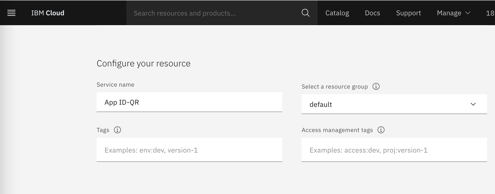
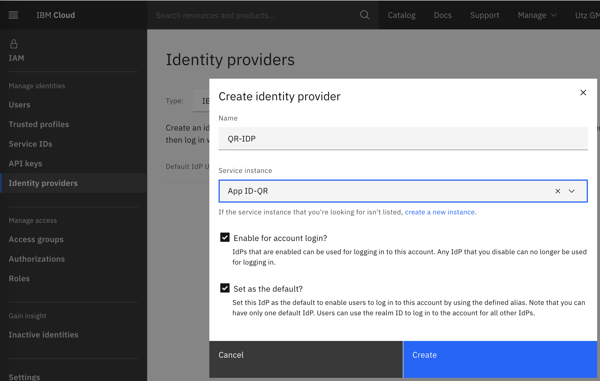
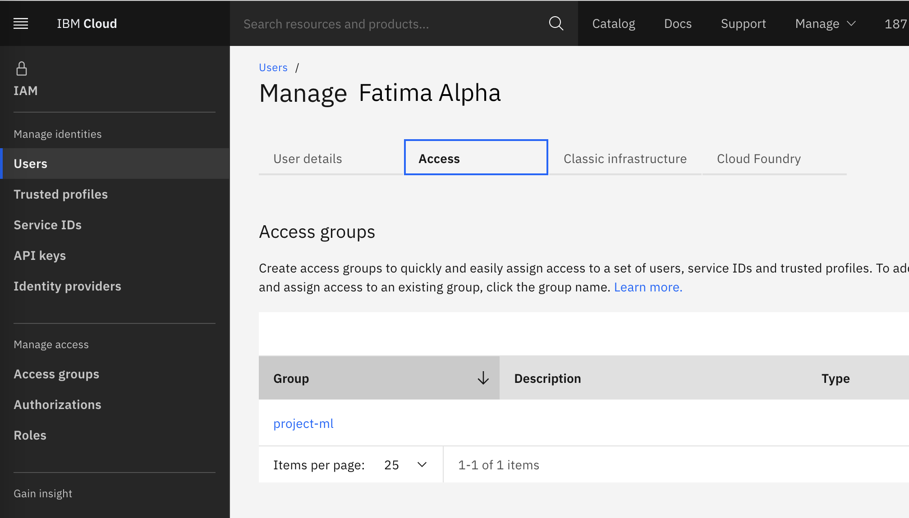
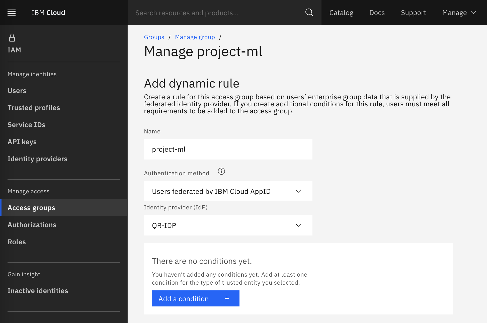
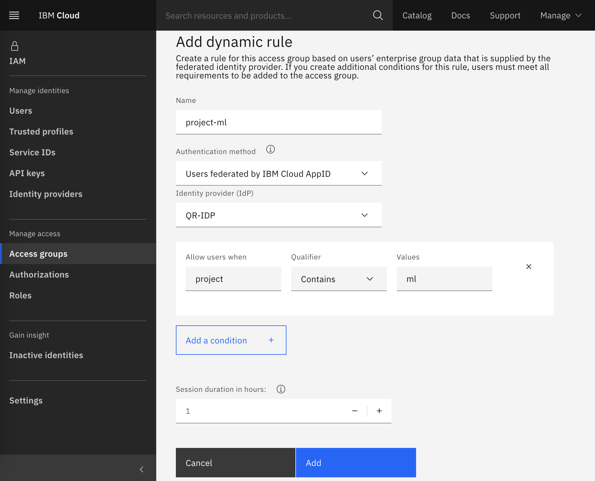

Manage users
======================

You can manage IBM Cloud users or ID provider users.  Follow the instructions in the relevant section, depending on your setup. 

- ::ref:`cloud` 
- :ref:`provider-appid` 
- :ref:`provider-cloud`

.. `_cloud:`

Manage IBM Cloud users
----------------------

This tutorial how to use IBM Cloud to enable users who have IBM Cloud accounts and gives instructions for users to access the environment.

Invite users
~~~~~~~~~~~~~

1. Ensure that the users that you want to invite have IBM Cloud accounts.

2. Go to Manage → Access (IAM) and click `Invite users <https://cloud.ibm.com/iam/users/invite_users>`__.

3. Enter the email addresses of users to be added.

4. Select the access group or groups of the projects that the users will be part of. These assignments can be changed later.

5. Click Add to confirm the access group selection.

6. Click Invite to send the invitation to the users.

   .. note::
      Users cannot be managed until they accept the invitation and log in at least once.

Optional: Modify users’ project assignments
~~~~~~~~~~~~~~~~~~~~~~~~~~~~~~~~~~~~~~~~~~~~~~~~~~~~

1. Go to `Manage → Access (IAM) → Users <https://cloud.ibm.com/iam/users>`__ and click the user.

   |change1|

2. Add access groups with **Assign group** or remove the user from an access group by clicking the three dot menu and choosing **Remove user**.

User Flow
~~~~~~~~~~~~~

1. After they accept an invitation, users can log in through the `IBM Cloud portal <https://cloud.ibm.com/>`__.
2. To work with Qiskit Runtime service instances, users must create an API key by going to `Manage → Access (IAM) → API keys <https://cloud.ibm.com/iam/apikeys>`__.
3. For further information, users can review `Getting started, Step 2 <quickstart#install-packages>`__.

Example scenario
~~~~~~~~~~~~~~~~~~~~~~~~~~

In our example, we want to create the following setup:

-  We have two projects, ``ml`` and ``finance``.

   -  The ``ml`` project should have access to the service instances ``QR-ml`` and ``QR-common``.
   -  The ``finance`` project should have access to the service instances ``QR-finance`` and ``QR-common``.

-  We have three users:

   -  Fatima should have access to the ``ml`` project.
   -  Ravi should have access to the ``finance`` project.
   -  Amyra should have access to both projects.

-  We will use access groups without resource groups.
-  Users are defined in IBM Cloud and project assignments are done there as well.
-  Users should be able to delete jobs.

The steps to implement this setup are:

2. The Cloud administrator creates three service instances: ``QR-ml``, ``QR finance``, and ``QR-common``.
3. The Cloud administrator creates a custom rule that includes the ``quantum-computing.job.delete`` action.
4. The Cloud administrator creates two access groups:

   -  The ``ml`` access group can access ``QR-ml`` and ``QR-common``.
   -  The ``finance`` access group can access ``QR-finance`` and ``QR-common``.

5. The Cloud administrator invites cloud users to the appropriate project. Specifically, they invite and assign users to an access group that includes the project.

   -  Fatima is added to the “ml” access group.
   -  Ravi is added to the “finance” access group.
   -  Amyra is added to both the “ml” and “finance” access groups.

6. Users can log in through the IBM Cloud portal, create API keys, and work with their projects’ service instances.

.. _provider-cloud:

Manage ID provider users with IBM Cloud
-------------------------------------------

App ID creates an ID provider so you can add users directly in App ID or connect to other external ID providers. This tutorial describes how to set up your ID provider to work with IBM Cloud users, and gives instructions for users to access the environment.

Create an App ID instance
~~~~~~~~~~~~~~~~~~~~~~~~~~~

1. `Open App ID from the IBM Cloud catalog <https://cloud.ibm.com/catalog/services/app-id>`__ and log in if necessary. Specify the following values:

   -  For **Select a location**, it is recommended that you keep it in the same location as the Qiskit Runtime service, which is ``Washington DC (us-east)``.
   -  **Select a pricing plan**:

      -  The **Lite** plan is free of charge and is enough to get started. If needed, you can seamlessly upgrade to the graduated tier later.
      -  The **Graduated tier** is paid per event and per user beyond the lite tier limits. This tier supports more features such as multi-factor authentication. The Cloud administrator as the owning account of the App ID instance is charged for any fees for the graduated tier instances.

   -  Complete the values for **Service name** (the App ID instance name), **Resource group** (if one is being used), and any tags you want.

   |create1|

2. Read and agree to the terms and click **Create**.

Configure the ID provider
~~~~~~~~~~~~~~~~~~~~~~~~~~~

We will use the **Cloud Directory** capability to add users to the ID provider. Refer to the `App ID documentation <https://cloud.ibm.com/docs/appid>`__ for instructions how to integrate other ID providers into App ID.

1. Open the `IBM Cloud resource list <https://cloud.ibm.com/resources>`__, expand the **Services and software** section, find your App ID instance and click its name to view its details.
2. Click **Manage Authentication** and deselect any login options that you don’t need, such as Facebook and Google.
3. Go to **Manage Authentication** → **Cloud Directory** → **Settings** and choose whether user logins should use email or usernames.
4. Optionally go to **Manage Authentication** → **Cloud Directory** → **Password Policies** to define the password strength.
5. Optionally open **Login Customization** and customize the appearance of the login page.

Integrate the App ID instance as the ID provider for the administrator’s account
~~~~~~~~~~~~~~~~~~~~~~~~~~~~~~~~~~~~~~~~~~~~~~~~~~~~~~~~~~~~~~~~~~~~~~~~~~~~~~~~~~~~~~

1. Go to `Manage → Access (IAM) → Identity Providers <https://cloud.ibm.com/iam/identity-providers>`__. For **Type**, choose **IBM Cloud App ID**, then click **Create**.

2. Specify a name and select the App ID instance from the drop-down list.

3. Select the checkbox to enable the ID provider.

   |identity1|

4. The default IdP URL is shown. Share this URL with users when they need to log in.

Add Users
~~~~~~~~~~

When you use App ID as ID provider with the Cloud directory, you can create users in the IBM Cloud user interface.

1. Open the App ID instance page from the `resource list <https://cloud.ibm.com/resources>`__ Services and software section.
2. Go to **Manage Authentication** → **Cloud Directory** → **Users**, and click **Create User**. Enter the user details.

Create or modify users’ project assignments
~~~~~~~~~~~~~~~~~~~~~~~~~~~~~~~~~~~~~~~~~~~~

1. Go to `Manage → Access (IAM) → Users <https://cloud.ibm.com/iam/users>`__ and click the user.

   |access1|

   .. note::
      If you don’t see the user that you want to manage, verify that they logged in to IBM Cloud at least once. See step 1 in the :ref:`user-org`.

2. Add access groups with **Assign group** or remove the user from an access group by clicking the three dot menu and choosing **Remove user**.

.. _user-org:

User flow
~~~~~~~~~~~~

1. A user is sent the ID provider URL for the IBM Cloud account. They use this URL and the login information to access the system. The user should change their password after they log on.

   .. note::
      The administrator can always go to `Manage → Access (IAM) → Identity providers <https://cloud.ibm.com/iam/identity-providers>`__ to look up the ID provider URL.

2. To work with Qiskit Runtime and access service instances, users need to create an API key from `Manage → Access (IAM) → API keys <https://cloud.ibm.com/iam/apikeys>`__.

3. For further information, users can review `Getting started, Step 2 <quickstart#install-packages>`__.

Example scenario
~~~~~~~~~~~~~~~~

In our example, we want to create the following setup:

-  We have two projects, ``ml`` and ``finance``.

   -  The ``ml`` project needs access to the service instances ``QR-ml`` and ``QR-common``.
   -  The ``finance`` project should have access to the service instances ``QR-finance`` and ``QR-common``.

-  We have three users:

   -  Fatima needs access to the ``ml`` project.
   -  Ravi needs access to the ``finance`` project.
   -  Amyra needs access to both projects.

-  We will use access groups without resource groups.
-  Users are defined in IBM Cloud but project assignments are done in an App ID instance.
-  Users should be able to delete jobs.

The steps to implement this setup are:

1. The Cloud administrator creates an App ID instance and ensures that it is linked in the Cloud administrator’s account. The administrator notes the ID provider URL to share it with users.
2. The Cloud administrator creates three service instances: ``QR-ml``, ``QR finance``, and ``QR-common``.
3. The Cloud administrator creates a custom rule that includes the ``quantum-computing.job.delete`` action.
4. The Cloud administrator creates two access groups:

   -  The ``ml`` access group can access ``QR-ml`` and ``QR-common``. This access group needs a dynamic rule for the App ID IDP that accepts users whose ``project`` attribute contains ``ml``.
   -  The ``finance`` access group can access ``QR-finance`` and ``QR-common``. This access group nees a dynamic rule for the App ID IDP that accepts users whose ``project`` attribute contains ``finance``.

5. The ID provider administrator defines the three users in the IBM Cloud user interface.
6. Users log in at least once.
7. The cloud administrator assigns access by adding users to the access groups that give them access to the projects:

   -  Fatima is given access to the ``ml`` project.
   -  Ravi is given access to the ``finance`` project.
   -  Amyra is given access to the ``ml`` and ``finanace`` projects.

8. Users can log in through the ID provider URL, create API keys, and work with their projects’ service instances.

.. _provider-appid:

Manage ID provider users with the ID provider
-----------------------------------------------

App ID creates an ID provider so you can add users directly in App ID or connect to other external ID providers. This tutorial describes how to set up your ID provider to work with users that do not have IBM Cloud accounts.

Create an App ID instance
~~~~~~~~~~~~~~~~~~~~~~~~~~~~~

1. `Open App ID from the IBM Cloud catalog <https://cloud.ibm.com/catalog/services/app-id>`__ and log in. Specify the following values:

   -  For **Select a location**, it is recommended to keep it in the same location as the Qiskit Runtime service, which is ``Washington DC (us-east)``.
   -  **Select a pricing plan**:

      -  The **Lite** plan is free of charge and is enough to get started. If needed, you can seamlessly upgrade to the graduated tier later.
      -  The **Graduated tier** is paid per event and per user beyond the Lite tier limits. This tier supports more features such as multi-factor authentication. The Cloud administrator as the owning account of the App ID instance is charged for any costs for the graduated tier instances.

   -  Complete the values for **Service name** (the App ID instance name), **Resource group** (if one is being used), and any tags you want.

   |create|

2. Read and agree to the terms and click **Create**.

Configure the ID provider
~~~~~~~~~~~~~~~~~~~~~~~~~~~~

We will use the **Cloud Directory** capability to add users to the ID provider. Refer to the `App ID documentation <https://cloud.ibm.com/docs/appid>`__ for instructions how to integrate other ID providers into App ID.

1. Open the `IBM Cloud resource list <https://cloud.ibm.com/resources>`__, expand the **Services and software** section, find your App ID instance and click its name to view its details.
2. Click **Manage Authentication** and deselect any login options that you don’t need, such as Facebook and Google.
3. Navigate to **Manage Authentication** → **Cloud Directory** → **Settings** and choose whether user logins should use email or usernames.
4. Optional: Open **Manage Authentication** → **Cloud Directory** → **Password Policies** to define the password strength.
5. Optionally open **Login Customization** and customize the appearance of the login page.

Integrate the App ID instance as the ID provider for the administrator’s account
~~~~~~~~~~~~~~~~~~~~~~~~~~~~~~~~~~~~~~~~~~~~~~~~~~~~~~~~~~~~~~~~~~~~~~~~~~~~~~~~~~~

1. Go to `Manage → Access (IAM) → Identity Providers <https://cloud.ibm.com/iam/identity-providers>`__. For **Type**, choose **IBM Cloud App ID**, then click **Create**.

2. Specify a name and select the App ID instance from the drop-down list.

3. Select the checkbox to enable the ID provider.

   |identity|

4. The default IdP URL is shown. Share this URL with users when they need to log in.

Add a dynamic rule to the access group
~~~~~~~~~~~~~~~~~~~~~~~~~~~~~~~~~~~~~~~~~~~~

The access group needs a dynamic rule to test whether it should be applied to an IDP user when they log in.

Because the dynamic rules are evaluated during login, any changes are picked up the next time the user logs in. {: note}

1. Navigate to `Manage → IAM → Access groups <https://cloud.ibm.com/iam/groups>`__ and click your access group to open its details page.
2. Click the **Dynamic rules** tab, then click **Add**.

   -  Provide a name.
   -  For the Authentication method, choose **Users federated by IBM Cloud AppID**, then select the IDP from the Identity provider drop-down list.

   |Dynamic|
3. Click **Add a condition**, complete the following values, then click **Add**.

   -  In the **Allow users when** field, enter the attribute key that is used by the IDP administrator in the ID provider user attributes, such as ``project`` (this string is a convention that is defined during planning).
   -  Select **Contains** as the **Qualifier**.
   -  In **Values**, enter the value, such as ``ml``. This is the same value that the IDP administrator uses in the IDP user profile definition. It is typically the project name.
   -  You might want to increase the **Session duration** to increase the period before users must log back in. Logged-in users keep their access group membership for that period, and reevaluation takes place on the next login.

   |Condition|

Add users
~~~~~~~~~~~~~~~

When you use App ID as ID provider with the Cloud directory, you can create users in the Cloud user interface.

1. Open the App ID instance page from the `resource list <https://cloud.ibm.com/resources>`__ Services and software section.
2. Go to **Manage Authentication** → **Cloud Directory** → **Users**, and click **Create User**. Enter the user details.

Create or modify users’ project assignments
~~~~~~~~~~~~~~~~~~~~~~~~~~~~~~~~~~~~~~~~~~~~~~~

If the IDP administrator will assign users to projects, you can define project values in the user’s attributes.

1. Open the App ID instance page from the `resource list <https://cloud.ibm.com/resources>`__ Services and software section.

2. Go to **Manage Authentication** → **Cloud Directory** → **Users**, and click a user to open it.

3. Scroll down to **Custom Attributes**, and click **Edit**.

4. Enter a key value pair that can will checked by the dynamic rules of the access groups, then click **Save**. You can add several values in the same string (for example, ``{"project":"ml finance"}``); the **contains** qualifier of the dynamic rule detects a match of a substring. For our example, add ``{"project":"ml"}``.

   The value ``project`` corresponds to the convention defined in the planning section. ``ml`` is the project that the user belongs to.

   This check is done on every login, so changes in the ID provider user attributes will be effective when a user next logs in.

User flow
~~~~~~~~~~~

1. A user is sent the ID provider URL for the IBM Cloud account.

   .. note::
      The administrator can always go to `Manage → Access (IAM) → Identity providers <https://cloud.ibm.com/iam/identity-providers>`__ to look up the ID provider URL.

2. To work with Qiskit Runtime serive instances, users must create an API key by going to `Manage → Access (IAM) → API keys <https://cloud.ibm.com/iam/apikeys>`__.

3. For further information, users can review `Getting started, Step 2 <quickstart#install-packages>`__.

Example scenario
~~~~~~~~~~~~~~~~

In our example, we want to create the following setup:

-  We have two projects, ``ml`` and ``finance``.

   -  The ``ml`` project needs access to the service instances ``QR-ml`` and ``QR-common``.
   -  The ``finance`` project needs access to the service instances ``QR-finance`` and ``QR-common``.

-  We have three users:

   -  Fatima needs access to the ``ml`` project.
   -  Ravi needs access to the ``finance`` project.
   -  Amyra needs access to both projects.

-  We will use access groups without resource groups.
-  Users are defined in an App ID instance and project assignments are also done there.
-  Users should be able to delete jobs.

The steps to implement this setup are:

1. The Cloud administrator creates an App ID instance and ensures that it is linked in the Cloud administrator’s account. The administrator notes the ID provider URL to share it with users.
2. The Cloud administrator creates three service instances: ``QR-ml``, ``QR finance``, and ``QR-common``.
3. The Cloud administrator creates a custom rule that includes the ``quantum-computing.job.delete`` action.
4. The Cloud administrator creates two access groups:

   -  The ``ml`` access group can access ``QR-ml`` and ``QR-common``. This access group needs a dynamic rule for the App ID IDP that accepts users whose ``project`` attribute contains ``ml``.
   -  The ``finance`` access group can access ``QR-finance`` and ``QR-common``. This access group needs a dynamic rule for the App ID IDP that accepts users whose ``project`` attribute contains ``finance``.

5. The IDP administrator uses the App ID instance that the Cloud administrator created and defines the three users:

   -  For Fatima, the custom attributes contain ``{"project":"ml"}``.
   -  For Ravi, the custom attributes contain ``{"project":"finance"}``.
   -  For Amyra, the custom attributes contain ``{"project":"ml finance"}``.

6. Users can log in through the ID provider URL, create API keys, and work with their projects’ service instances.

Next steps
----------

