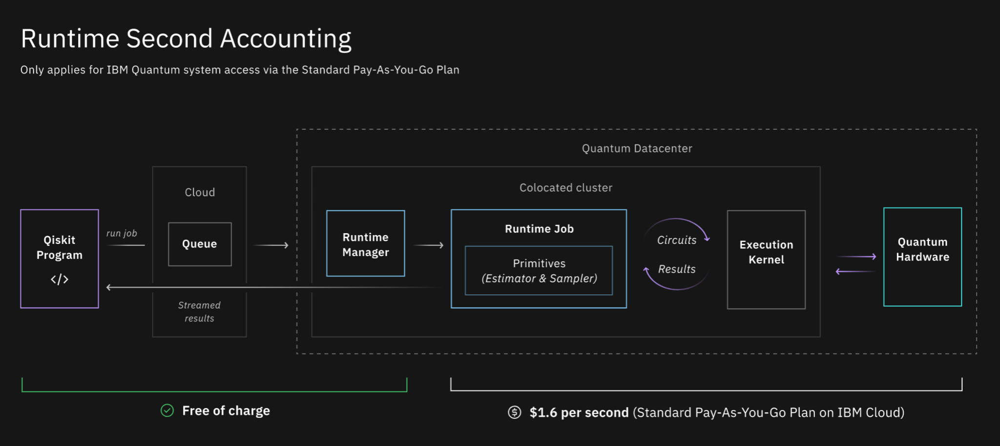

Qiskit Runtime plans
====================

The Qiskit Runtime service offers these plans for running quantum programs: 

- Lite Plan: Simulator access plan (free) 
- Standard Plan: Quantum hardware and simulator access plan

Lite plan
---------

A free plan that gives you access to quantum simulators to help you get started with Qiskit Runtime. It does not include access to IBM Quantum systems. The following simulators are included in this plan:

-  ``ibmq_qasm_simulator``: A general-purpose simulator for simulating quantum circuits both ideally and subject to noise modeling. The simulation method is automatically selected based on the input circuits and parameters.

   -  **Type**: General, context-aware
   -  **Simulated Qubits**: 32

-  ``simulator_statevector``: Simulates a quantum circuit by computing the wave function of the qubit’s state vector as gates and instructions are applied. Supports general noise modeling.

   -  **Type**: Schrödinger wave function
   -  **Simulated Qubits**: 32

-  ``simulator_mps``: A tensor-network simulator that uses a Matrix Product State (MPS) representation for the state that is often more efficient for states with weak entanglement.

   -  **Type**: Matrix Product State
   -  **Simulated Qubits**: 100

-  ``simulator_stabilizer``: An efficient simulator of Clifford circuits. Can simulate noisy evolution if the noise operators are also Clifford gates.

   -  **Type**: Clifford
   -  **Simulated Qubits**: 5000

-  ``simulator_extended_stabilizer``: Approximates the action of a quantum circuit by using a ranked-stabilizer decomposition. The number of non-Clifford gates determines the number of stabilizer terms.

   -  **Type**: Extended Clifford (for example, Clifford+T)
   -  **Simulated Qubits**: 63

Standard plan
-------------

A pay-as-you-go plan for accessing IBM Quantum systems. Build your own programs and access all the benefits of Qiskit Runtime by running on real quantum hardware, while maintaining access to all of the simulators available in the Lite plan.

Pricing overview
----------------

The Lite plan is free. The Standard plan charges you per *runtime second* when running on physical systems. The following diagram illustrates what is included in a runtime second. For this service, one runtime second includes only quantum compute time. Any time spent waiting for results or in the queue for the quantum computer are excluded.

   Runtime second accounting   

Next steps
----------

See `Manage costs <cost.html>`__ to learn how to determine and minimize your costs.

