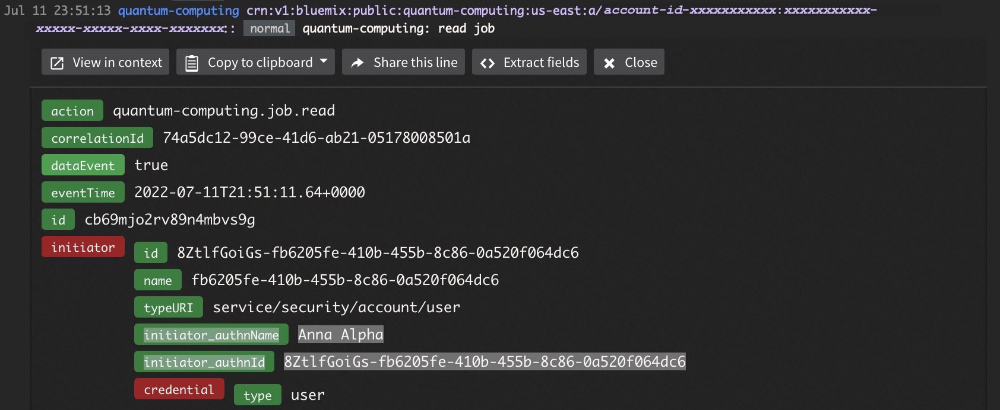

Plan Qiskit Runtime for an organization
=======================================

In an organization where individuals might work on several projects, Qiskit Runtime governance can seem complex. However, access management can be used to easily enable user collaboration and to restrict visibility of users and projects when necessary. Managing access becomes more relevant with Qiskit Runtime resources that are not free: that is, Qiskit Runtime service instances that use the Standard plan (which organizations are charged for).

Overview
--------

.. note::
   
   IBM Cloud provides various ways to implement these mechanisms described in this tutorial. There are several ways to achieve these objectives. Additionally, most of the steps in this tutorial are generic to IBM Cloud and not specific to Qiskit Runtime, except the custom role details.

Involved Personas
~~~~~~~~~~~~~~~~~

The are several main personas that are mentioned in this tutorial:

-  **User**: Someone who gets access to Qiskit Runtime resources (*service instances*) and can potentially collaborate with other users on these resources. Users’ access is controlled by an administrator and they cannot create or delete service instances.
-  **Cloud administrator**: An IBM Cloud account owner who owns Qiskit Runtime resources and manages which users can access these resources. As the resource owner, the administrator is charged for any paid resource use.
-  **IDP administrator**: An administrator who defines identities and their attributes in an identity provider (IDP).

Terminology
~~~~~~~~~~~

This tutorial uses the following terms:

-  *Resource*: A generic IBM Cloud term that refers to an object that can be managed through the Cloud user interface, CLI, or API. For this tutorial, a *resource* is a Qiskit Runtime service instance.

-  *Service instance*: A service instance is used to access Cloud functions. Specifically, quantum computing on real devices or simulators. It is defined through the catalog. You can define several service instances based on the same or different plans, which offer access to different quantum computing backends. See `Qiskit Runtime plans <plans.html>`__ for more details.

-  *Project*: A grouping unit that enables users to work on the same resources. This tutorial uses two projects; ``ml`` and ``finance``. See `Hierarchical project structures <considerations-org#nest-org.html>`__ for more information.

   .. note::

      This project is not related to the “project” concept in IBM Quantum Platform. 

Decisions
---------------

Before you set up Qiskit Runtime for your organization, you need to make these decisions:

-  How are user identities defined? You can set up IBM Cloud users, users from another IDP, or both.

   -  If you are using a different IDP, does the Cloud administrator or the IDP administrator assign users to project resources?
   -  If the IDP administrator assigns users to projects, you need a string to be used as a key, such as ``project`` (which this tutorial uses) for project comparisons.

-  What are the projects and which service instances will belong to each? You must plan your project names carefully.

   -  Do not make project names substrings of another. For example, if you use ``ml`` and ``chemlab`` for project names, then later you set up a project match for ``ml``, it triggers on both values, accidentally granting more access than expected. Instead, use unique names such as ``ml`` and ``chem-lab``. Alternatively, use prefix or suffix values to avoid such unintended substring matches.
   -  Using naming conventions, along with prefix or suffix values can help you easily allow access to several projects.
   -  Quantum experiments (jobs) belong to service instances, and users that have access to an instance can see its jobs.
   -  Service instances can be based on different plans, allowing access to different backends like real devices or simulators. See `Choose a system or simulator <../how_to/choose-system.html>`__ for details.

-  Which users need to access which projects?
-  Should users be able to delete jobs? Keeping jobs in service instances gives more traceability for billing costs. This information combines well with the audit trail of `Activity Tracker <at-events.html>`__, which tracks which user submitted the job.
-  Will you use access groups that directly reference Qiskit Runtime service instances or organize services into resource groups?

   -  **Access groups** are a convenient and common way of controlling user access for IBM Cloud resources. They are a simple but powerful means to consistently assign user access. We create an access group for each project and map users to access groups. Each access group uses a custom role that allows users to access specific Qiskit Runtime service instances or resource groups.
   -  **Resource groups** are used only when you need to maintain a clear separation of service instances. If more service instances are created in a resource group, all users that have access to the resource group see them automatically without updating access groups. If you choose to use resource groups, you will create access groups and then assign them to resource groups.

   .. note::
      
      A service instance can belong to only one resource group, and after instances are assigned into resource groups, they cannot be changed. This also means that the resource group assignment can happen only at service instance creation. Therefore, resource groups might not provide enough flexibility if assignments of service instances to resource groups might need to change.

Considerations
----------------

You should understand the following considerations when setting up your environment.

Auditability
~~~~~~~~~~~~~

Activity tracker logs significant actions performed on Qiskit Runtime service instances. Create an instance of Activity Tracker in the region of your Qiskit Runtime instances to get an audit trail of events. Refer to the Qiskit Runtime `Activity Tracker page <at_events.html>`__ for details about the events logged.

This audit log contains the fields ``initiator_authnName`` and ``initiator_authnId``, which match the name shown in `Manage → Access (IAM) → Users <https://cloud.ibm.com/iam/users>`__. To view this field, click on the user name, then **Details** in the **IAM ID** field.

|event|

To capture App ID events, open your App ID instance, then navigate to **Manage Authentication -> Authentication settings** and enable **Runtime Activity**.

Define more fine grained roles
~~~~~~~~~~~~~~~~~~~~~~~~~~~~~~~~

The actions in the custom roles can be used for more fine grained access control. For example, some users might need full access to work on service instances, while others might only need Read access to service instances, programs, and jobs.

To achieve that, define two different custom roles such as ``MLreader`` and ``MLwriter``. Remove all cancel, delete, and update roles from the ``MLreader`` custom role, and include all actions in the ``MLwriter`` custom role. Next, add the roles to two different access groups accordingly.

When using dynamic rules, that is, when the IDP administrator manages access through custom IDP user attributes, do not use IDP custom user attributes that are substrings of each other. For instance, don’t use ``ml`` and ``mlReader``, as the string comparison of ``ml`` would also accept ``mlReader``. You could use ``MLreader`` and ``MLwriter`` to avoid this conflict. {: note}

For an example of setting up custom roles, see `Create access groups for projects <quickstart-steps-org#create-group-org.html>`__.

Other Cloud resources
~~~~~~~~~~~~~~~~~~~~~~~

The steps used in this tutorial can be used to manage access to other Cloud resources as well. Include the appropriate permissions to the access groups of the relevant projects.

Hierarchical project structures
~~~~~~~~~~~~~~~~~~~~~~~~~~~~~~~~

In this tutorial, the mapping of users to projects and service instances was kept simple. However, by associating several users with access groups and referencing service instances from several access groups, more complex mappings can be implemented.

This method can accommodate a hierarchical structure. That is, it can align to how users might be assigned to the Hub/Group/Project access structure in the IBM Quantum Platform. For example, a *group* could be an access group that is assigned to all service instances of the group’s projects. Users who should get access to all of the group’s projects would then only have to be added to the group’s access group.

Consistent and repeatable deployment of the configuration
~~~~~~~~~~~~~~~~~~~~~~~~~~~~~~~~~~~~~~~~~~~~~~~~~~~~~~~~~~

The steps of this tutorial can be automated for consistent and repeatable management of users, projects, and the mapping between those. Refer to the `Terraform IBM Cloud Provider documentation <https://registry.terraform.io/providers/IBM-Cloud/ibm/latest/docs>`__ for templates.

Next steps
----------

See `Configure Qiskit Runtime for an organization <quickstart-steps-org.html>`__ for the steps to set up Qiskit Runtime.

