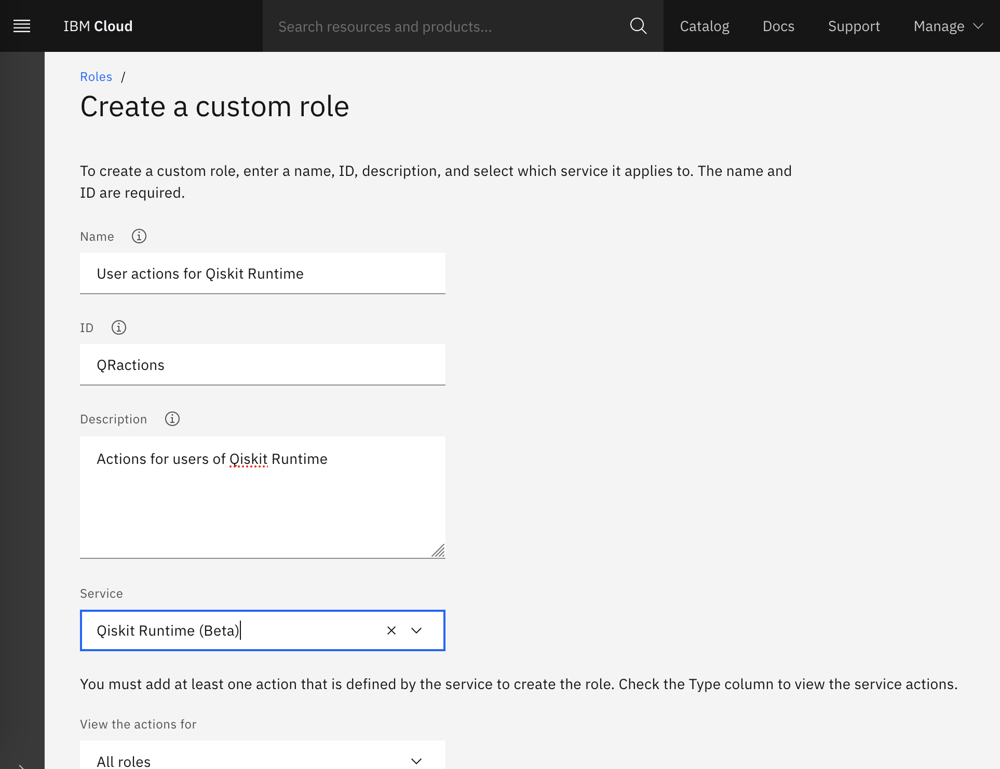
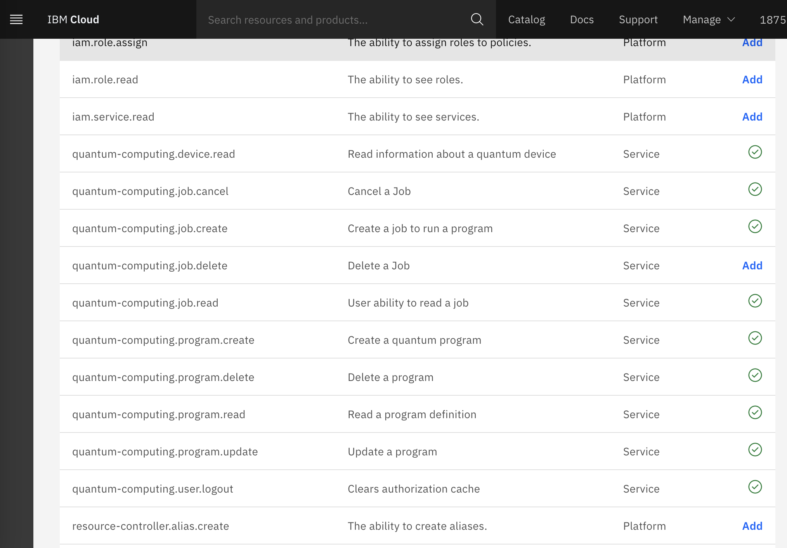
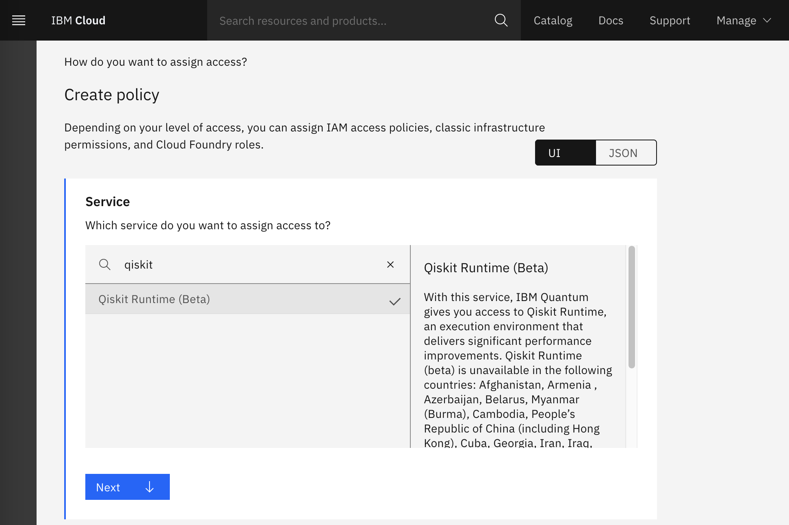
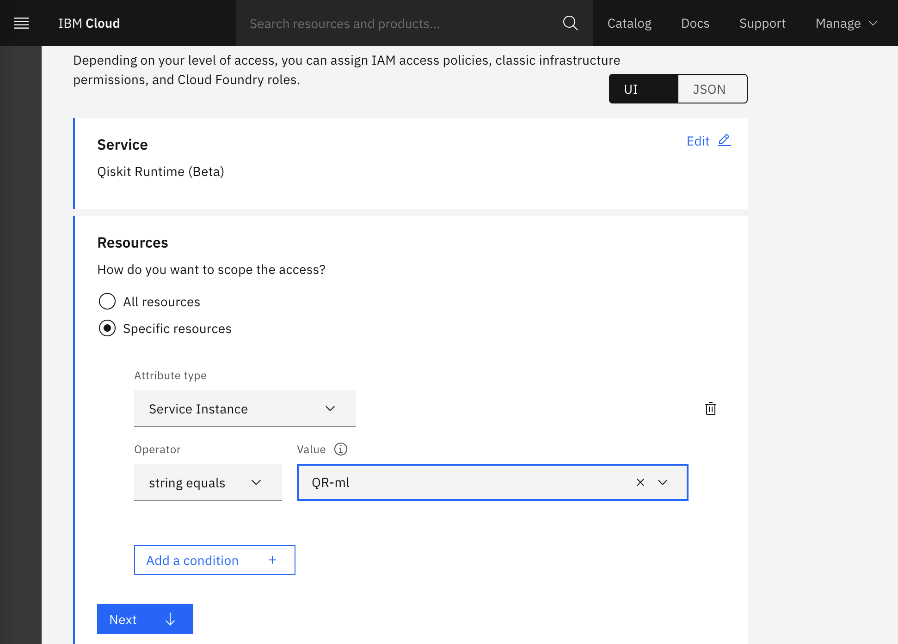
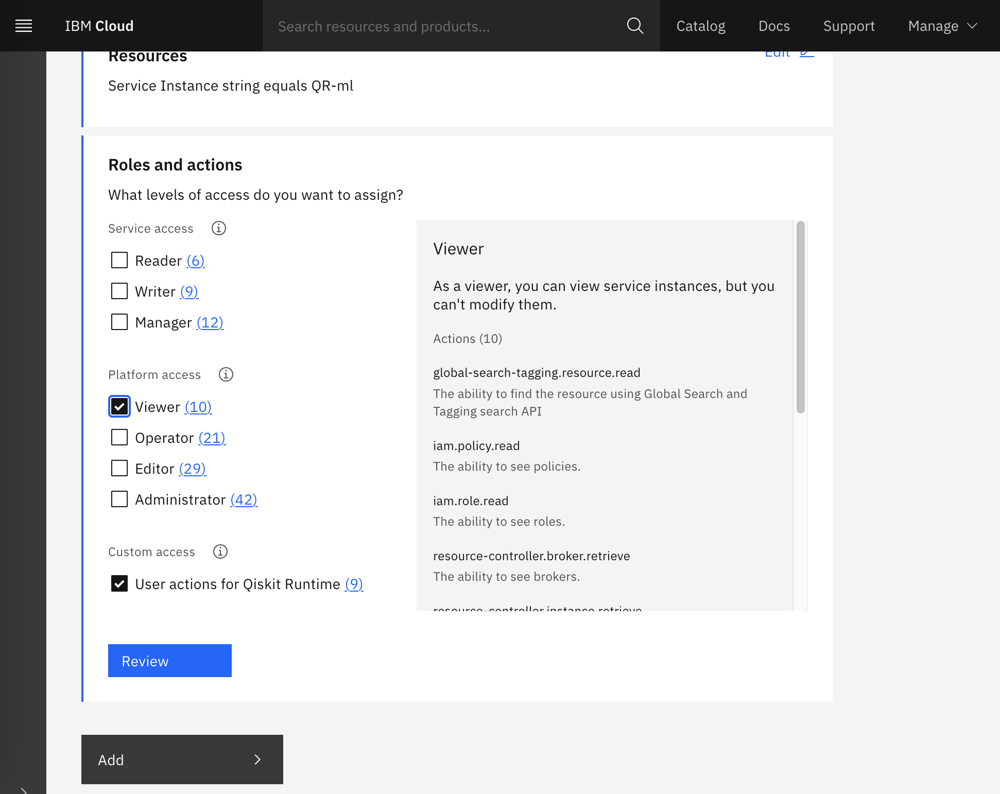

Configure Qiskit Runtime for an organization
============================================

Follow these steps to start setting up Qiskit runtime.

Configure IAM settings
----------------------

First, configure some settings in the administrator’s Identity and Access Management (IAM) account. To review and configure these settings, go to `Manage → IAM → Settings <https://cloud.ibm.com/iam/settings>`__.

-  **User list visibility** determines whether users can see each other, regardless of project assignment. The ``enabled`` setting restricts user visibility. That is, users in your account cannot see each other, even if they can access the same resources. Choose the appropriate value for your environment. See `Controlling user visibility <https://cloud.ibm.com/docs/account?topic=account-iam-user-setting>`__ for more information.
-  **API key creation** controls whether users can create API keys. In Qiskit Runtime, it is common to use API keys. If API keys are being used, choose ``disabled``. Alternatively, you can give specific permissions to each user.

|IAM settings|

.. _create-group-org:

(Optional) Create resource groups
---------------------------------

Skip this step if you are using access groups that directly reference Qiskit Runtime service instances.

If you chose to use resource groups, go to `Manage → Account → Resource groups (in Account resources) <https://cloud.ibm.com/account/resource-groups>`__ and click **Create**.

Create Qiskit Runtime service instances
---------------------------------------

If you already created Qiskit Runtime service instances, skip this step.

-  If you are using resource groups, make sure to create the service instances on the appropriate resource group.
-  The service instance name, such as ``QR-ml``, is needed for access group references.

1. From the `Qiskit Runtime Provisioning page <https://cloud.ibm.com/catalog/services/quantum-computing>`__, select the Create tab, then choose the appropriate service plan, depending on what you need access to:

   -  **Lite**: Free simulators-only plan to help you get started with Qiskit Runtime. Learn to use Qiskit Runtime by following our examples and tutorials for one of the pre-built programs available for running circuits efficiently.
   -  **Standard**: A pay-as-you-go model for accessing IBM Quantum systems and simulators. Build your own programs and use all the benefits of Qiskit Runtime by running on real quantum hardware.

2. Complete the required information, then click **Create**.

Create access groups for projects
---------------------------------

First, we create a custom role that allows users to perform actions to work with Qiskit Runtime service instances for each access group. Next, we create an access group for each project and give that group the minimum set of permissions that are required to work with the project resources. In a later step, we map users to access groups.

Follow these steps to set up an access group:

1. Create a custom role.

   1. From `Manage → IAM → Roles <https://cloud.ibm.com/iam/roles>`__, click ``Create``.

   2. Enter a name, ID, description, and select ``Qiskit Runtime`` from the service, as shown in the image:

   |custom|

   3. Select the following roles, then click **Create**.

      -  quantum-computing.device.read
      -  quantum-computing.job.cancel
      -  quantum-computing.job.create
      -  quantum-computing.job.read
      -  quantum-computing.program.create
      -  quantum-computing.program.delete
      -  quantum-computing.program.read
      -  quantum-computing.program.update
      -  quantum-computing.user.logout
      -  Select quantum-computing.job.delete if you want to allow users to delete jobs.

      |actions|

      .. note::
         You can optionally define more fine grained roles by following `these instructions <considerations-org#more-roles-org>`__.

2. Create an access group.

   1. Go to `Manage → IAM → Access groups <https://cloud.ibm.com/iam/groups>`__ and click **Create**.
   2. Enter a name, like ``project-ml``, and a description.

3. Assign access to the group.

   1. Select the Access tab and click **Assign access**.

   2. In the Service list, search for **Qiskit Runtime** and select it, then click **Next**.

   |service|

   3. In Resources, select **Specific resources**. For Attribute type, choose **Service Instance**.

   4. From the drop-down list, select the service instance that you want to add to the access group, for example, ``QR-ml``. If you are using resource groups, select the resource group instead of selecting individual service instances. Click **Next**.

   |resources|

   5. For Roles and actions, select **Viewer** and the custom role that was created previously. Click **Add**, then **Assign**.

   |roles|

   6. Repeat this step if you want to give an access group permission to several service instances.

Set up your ID provider and assign users
----------------------------------------

Follow the steps in the `manage users topic <cloud-provider-org.html>`__.

.. |IAM settings| image:: ../images/org-guide-iam-settings.png

