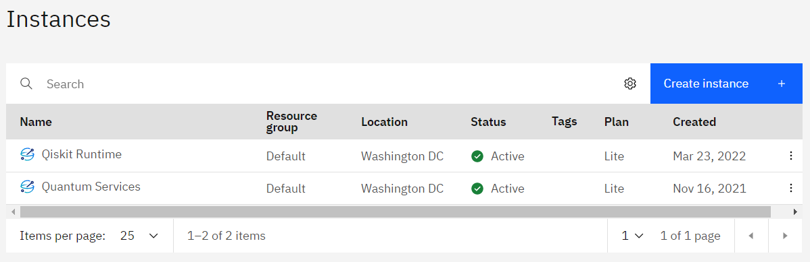

Getting started
================

This tutorial walks you through the steps to set up a Qiskit Runtime service instance, log in to your service instance, and run your first job on a quantum computer.

If you are an administrator who needs to set up Qiskit Runtime for your organization, refer to `Plan Qiskit Runtime for an organization <quickstart-org>`__ for instructions to set up a service instance and work with users.

Create a service instance
---------------------------------

If you already created a Qiskit Runtime service instance or were invited to one by an administrator, skip to the next step. To determine whether you already have access to an instance, check your `IBM Cloud Instances page <https://cloud.ibm.com/quantum/instances>`__. If you have one or more instances shown, you can skip ahead to :ref:`install-packages`.

   Instances page showing multiple instances.   

1. From the `Qiskit Runtime Provisioning page <https://cloud.ibm.com/catalog/services/quantum-computing>`__, choose the appropriate service plan, depending on what you need access to. For more information about these plans, see the `Qiskit Runtime plans <plans>`__ topic.

      - **Lite**: Free simulators-only plan to help you get started with Qiskit Runtime. Learn to use Qiskit Runtime by following our examples and tutorials for one of the pre-built programs available for running circuits efficiently.
      - **Standard**: A pay-as-you-go model for accessing IBM Quantum systems. Build your own programs and leverage all the benefits of Qiskit Runtime by running on real quantum hardware.

      Because this is not a free plan, it is important to understand how to best manage your costs. See `Manage the cost <cost>`__ for tips to limit your cost, how to set up spending notifications, and more.

      .. note::

         If you want to access physical devices as well as simulators, you need to set up one instance with the Lite plan and one instance with the Standard plan.
      

2. Complete the required information, then click **Create**.

.. _install-packages:

Install or update Qiskit packages
-----------------------------------

Install or update the following packages in your development environment. They let you create circuits and work with primitive programs with Qiskit Runtime. For detailed instructions, refer to the `Qiskit textbook <https://qiskit.org/textbook/ch-appendix/qiskit.html>`__. Periodically check the `Qiskit release notes <https://qiskit.org/documentation/release_notes.html>`__ (or rerun these commands) so that you always have the latest version.

 .. note::

    Be sure to run these commands even if you already installed the packages, to ensure that you have the latest versions.

.. code-block:: python

   # Installs the latest version of the Qiskit meta-package for circuit creation.
   pip install qiskit -U

.. code-block:: python

   # Installs the latest version of the Qiskit Runtime package, which is needed to interact with the Qiskit Runtime primitives on IBM Cloud.
   pip install qiskit-ibm-runtime -U

Authenticate to the service
-----------------------------------

To authenticate to the service, call "QiskitRuntimeService" with your IBM Cloud API key and the CRN:

.. code-block:: python

   from qiskit_ibm_runtime import QiskitRuntimeService

   service = QiskitRuntimeService(channel="ibm_cloud", token="<IBM Cloud API key>", instance="<IBM Cloud CRN>")

Find your access credentials
^^^^^^^^^^^^^^^^^^^^^^^^^^^^^^^

1. Find your API key. From the `API keys page <https://cloud.ibm.com/iam/apikeys>`__, view or create your API key, then copy it to a secure location so you can use it for authentication.
2. Find your Cloud Resource Name (CRN). Open the `Instances page <https://cloud.ibm.com/quantum/instances>`__ and click your instance. In the page that opens, click the icon to copy your CRN. Save it in a secure location so you can use it for authentication.

Optionally save your credentials to disk
-------------------------------------------

Optionally save your credentials to disk (in the "$HOME/.qiskit/qiskit-ibm.json" file). If you don't save your credentials to disk, you must specify your credentials every time you start a new session.

If you save your credentials to disk, you can use "QiskitRuntimeService()" in the future to initialize your account.

.. code-block:: python

   from qiskit_ibm_runtime import QiskitRuntimeService

   # Save account to disk.
   QiskitRuntimeService.save_account(channel="ibm_cloud", token="<IBM Cloud API key>", instance="<IBM Cloud CRN>")

   service = QiskitRuntimeService()

If you need to update your saved credentials, run "save_account" again, passing in "overwrite=True"  and the updated credentials. For more information about managing your account, see the `account management tutorial <https://qiskit.org/documentation/partners/qiskit_ibm_runtime/tutorials/04_account_management.html>`__.

Test your setup
-------------------

Run the Hello World program to ensure that your environment is set up properly.

.. note::
   If you are using the Standard plan, running Hello World incurs a cost. See `Manage costs <cost>`__ for cost information.

If you did not save your credentials to disk, specify "QiskitRuntimeService(channel="ibm_cloud", token=<IBM Cloud API key>, instance=<IBM Cloud CRN>)"
instead of "QiskitRuntimeService()" in the following code.

.. code-block:: python

   from qiskit_ibm_runtime import QiskitRuntimeService

   service = QiskitRuntimeService()
   program_inputs = {'iterations': 1}
   options = {"backend_name": ""}
   job = service.run(program_id="hello-world",
                  options=options,
                  inputs=program_inputs
                 )
   print(f"job id: {job.job_id}")
   result = job.result()
   print(result)

Result:

.. code-block:: 

       Hello world!

Choose a program to run
----------------------------------

Qiskit Runtime uses primitive programs to interface with quantum computers. The following programs are publicly available. Choose the appropriate link to continue learning how to run a program.

.. nbgallery::

   ../tutorials/how-to-getting-started-with-sampler
   ../tutorials/how-to-getting-started-with-estimator

