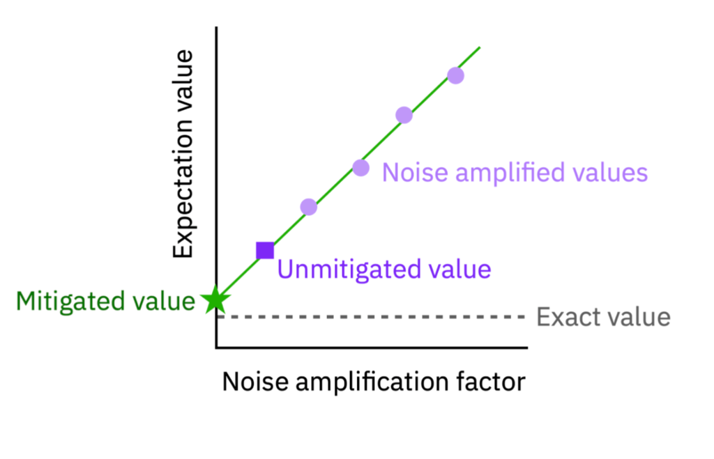
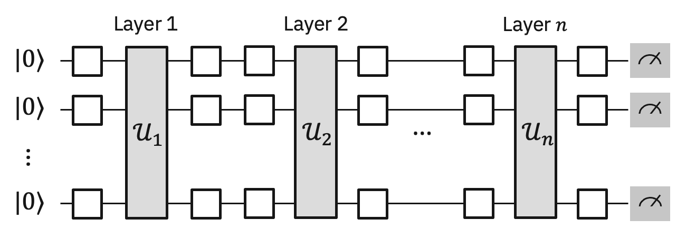
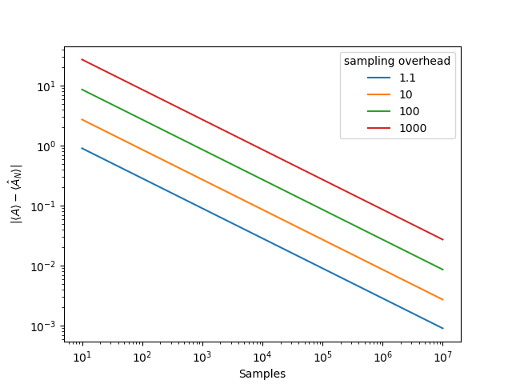
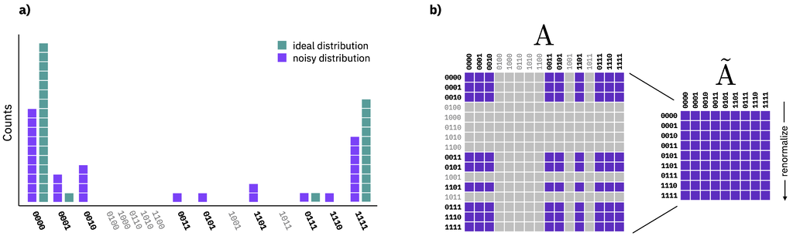

Configure error mitigation
=============================

Error mitigation techniques allow users to mitigate circuit errors by modeling the device noise at the time of execution. This typically results in quantum pre-processing overhead related to model training and classical post-processing overhead to mitigate errors in the raw results by using the generated model.  

The error mitigation techniques built in to primitives are advanced resilience options.   To specify these options, use the `resilience_level` option when submitting your job.  

The resilience level specifies how much resilience to build against errors. Higher levels generate more accurate results, at the expense of longer processing times. Resilience levels can be used to configure the cost/accuracy trade-off when applying error mitigation to your primitive query. Error mitigation reduces errors (bias) in results by processing the outputs from a collection, or ensemble, of related circuits. The degree of error reduction depends on the method applied. The resilience level abstracts the detailed choice of error mitigation method to allow users to reason about the cost/accuracy trade that is appropriate to their application.

Given this, each level corresponds to a method or methods with increasing level of quantum sampling overhead to enable you experiment with different time-accuracy tradeoffs.  The following table shows you which levels and corresponding methods are available for each of the primitives. 

.. note::
    Error mitigation is task specific so the techniques you are able to apply vary based whether you are sampling a distribution or generating expectation values. 

+------------------+-------------------------------------------------------+-----------------------------------+---------+
| Resilience Level | Definition                                            | Estimator                         | Sampler |
+==================+=======================================================+===================================+=========+
| 0                | No mitigation                                         | None                              | None    |
+------------------+-------------------------------------------------------+-----------------------------------+---------+
| 1 [Default]      | Minimal mitigation costs: Mitigate error associated   | Twirled Readout Error eXtinction  | M3      |
|                  | with readout errors                                   | (:ref:`TREX <TREX>`)              |         |
+------------------+-------------------------------------------------------+-----------------------------------+---------+
| 2                | Medium mitigation costs. Typically reduces bias       | Zero Noise Extrapolation          | ---     |
|                  | in estimators, but is not guaranteed to be zero bias. | (:ref:`ZNE <ZNE>`)                |         |
+------------------+-------------------------------------------------------+-----------------------------------+---------+
| 3                | Heavy mitigation with layer sampling. Theoretically   | Probabilistic Error Cancellation  | ---     |
|                  | expected to deliver zero bias estimators.             | (:ref:`PEC <PEC>`)                |         |
+------------------+-------------------------------------------------------+-----------------------------------+---------+

.. note::
    Resilience levels are currently in beta so sampling overhead and solution quality will vary from circuit to circuit. New features, advanced options and management tools will be released on a rolling basis. Specific error mitigation methods are not guaranteed to be applied at each resilience level.

Configure the Estimator with resilience levels 
-----------------------------------------------

.. raw:: html

  

  
Resilience Level 0

No error mitigation is applied to the user program.

.. raw:: html

   

.. raw:: html

  

  
Resilience Level 1

.. _TREX:

Level 1 applies error mitigation methods that particularly address readout errors. In the Estimator, we apply a model-free technique known as Twirled Readout Error eXtinction (TREX). It reduces measurement error by diagonalizing the noise channel associated with measurement by randomly flipping qubits via X gates immediately prior to measurement, and flipping the corresponding measured bit if an X gate was applied. A rescaling term from the diagonal noise channel is learned by benchmarking random circuits initialized in the zero state. This allows the service to remove bias from expectation values that result from readout noise. This approach is described further in `Model-free readout-error mitigation for quantum expectation values <https://arxiv.org/abs/2012.09738>`__.

.. raw:: html

   

.. raw:: html

  

  
Resilience Level 2

.. _ZNE:

Level 2 leverages Zero Noise Extrapolation method (ZNE) which computes an expectation value of the observable for different noise factors (amplification stage) and then uses the measured expectation values to infer the ideal expectation value at the zero-noise limit (extrapolation stage). This approach tends to reduce errors in expectation values, but is not guaranteed to produce an unbiased result. 

   Illustration of the ZNE method

The overhead of this method scales with the number of noise factors. The default settings sample the expectation value at three noise factors, leading to a roughly 3x overhead when employing this resilience level.   

.. raw:: html

   

.. raw:: html

  

  
Resilience Level 3

.. _PEC:

Level 3 enables the Probabilistic Error Cancellation (PEC) method. This approach mitigates error by learning and inverting a sparse noise model that is able to capture correlated noise. PEC returns an unbiased estimate of an expectation value so long as learned noise model faithfully represents the actual noise model at the time of mitigation.  In practice, the experimental procedure for learning the noise model has ambiguities due to certain error terms that cannot be independently distinguished. These are resolved by a symmetry assumption, which depending on the true underlying noise may lead a biased estimate of the mitigated expectation values due to using an imperfect noise model. 

The Qiskit Runtime primitive implementation of PEC specifically addresses noise in self-inverse two-qubit gates, so it first *stratifies* each input circuit into an alternating sequence of simultaneous 1-qubit gates followed by a layer of simultaneous 2-qubit gates. Then it learns the noise model associated with each unique 2-qubit gate layer.

   This is an example of a `stratified` circuit, where the layers of two-qubit gates are labeled layer 1 through n. Note that each :math:`U_l` is composed of two-qubit gates on the native connectivity graph of the quantum processor. The open boxes represent arbitrary single-qubit gates.

The overhead of this method scales with the number of noise factors. The default settings sample the expectation value at three noise factors, leading to a roughly 3x overhead when employing this resilience level.   

PEC uses a quasi-probability method to mimic the effect of inverting the learned noise. This requires sampling from a randomized circuit family associated with the user’s original circuit. Applying PEC will increase the variability of the returned expectation value estimates unless the number of samples per circuit is also increased for both input and characterization circuits. The amount of samples required to counter this variability scales exponentially with the noise strength of the mitigated circuit. 

How this works:

When estimating an unmitigated Pauli observable :math:`\langle P\rangle` the standard error in the estimated expectation value is given by :math:`\frac{1}{\sqrt{N_{\mbox{shots}}}}\left(1- \langle P\rangle^2\right)` where :math:`N_{\mbox{shots}}` is the number of shots used to estimate :math:`\langle P\rangle`. When applying PEC mitigation, the standard error becomes :math:`\sqrt{\frac{S}{N_{\mbox{samples}}}}\left(1- \langle P\rangle^2\right)` where :math:`N_{\mbox{samples}}` is the number of PEC samples.

The sampling overhead scales exponentially with a parameter that characterizes the collective noise of the input circuit. As the Qiskit Runtime primitive learns the noise of your circuit, it will return metadata about the sampling overhead associated with that particular layer.  Let's label the overhead of layer :math:`l` as :math:`\gamma_l`. Then the total sampling overhead for mitigating your circuit is the product of all the layer overheads, that is:

:math:`S = \prod_l \gamma_l`

When the Estimator completes the model-learning phase of the primitive query, it will return metadata about the total sampling overhead for circuit.

Depending on the precision required by your application, you will need to scale the number of samples accordingly. The plot below illustrates the relationship between estimator error and number of circuit samples for different total sampling overheads.

Note that the number of samples required to deliver a desired accuracy is not known before the primitive query because the mitigation scaling factor is discovered during the learning phase of PEC.

We recommend starting with short depth circuits to get a feel for the scaling of the sampling overhead of PEC prior to attempting larger problems.

.. raw:: html

   
   

Example
^^^^^^^

The Estimator interface lets users seamlessly work with the variety of error mitigation methods to reduce error in expectation values of observables. Below is an example of leveraging Zero Noise Extrapolation by simply setting ``resilience_level 2``.

.. code-block:: python

  from qiskit_ibm_runtime import QiskitRuntimeService, Session, Estimator, Options

  service = QiskitRuntimeService()
  options = Options()
  options.resilience_level = 2
  options.optimization_level = 3

  with Session(service=service, backend="ibmq_qasm_simulator") as session:
      estimator = Estimator(session=session, options=options)
      job = estimator.run(circuits=[psi1], observables=[H1], parameter_values=[theta1])
      psi1_H1 = job.result() 
      session.close()

.. note::
    As you increase the resilience level, you will be able to leverage additional methods to improve the accuracy of your result. However, because the methods become more advanced with each level, they require additional sampling overhead (time) to generate more accurate expectation values.     

Configure Sampler with resilience levels 
-----------------------------------------

The Sampler default resilience setting (level 1) enables readout error mitigation to allow users to generate mitigated quasi-probability distributions. 

.. raw:: html

  

  
Resilience Level 1

Level 1 leverages matrix-free measurement mitigation (M3) routine to mitigate readout error. M3 works in a reduced subspace defined by the noisy input bitstrings that are to be corrected. Because the number of unique bitstrings can be much smaller than the dimensionality of the full multi-qubit Hilbert space, the resulting linear system of equations is nominally much easier to solve.

   Illustration of the M3 method

.. raw:: html

   

.. code-block:: python

    from qiskit_ibm_runtime import QiskitRuntimeService, Session, Sampler, Options

    service = QiskitRuntimeService()
    options = Options()
    options.resilience_level = 1
    options.optimization_level = 3

    with Session(service=service, backend="ibmq_qasm_simulator") as session:
        sampler = Sampler(session=session, options=options)     

Advanced resilience options
----------------------------

You can tune advanced options to configure your resilience strategy further. These methods can be used alongside resilience levels where you change the specific options of interest and let your previously set resilience level manage the rest. 

As a part of the beta release of the resilience options, users will be able configure ZNE by using the following advanced options below. We will soon add options to tune other resilience levels that include PEC. 

+---------------------------------------------------------------+----------------------------------+--------------------------------------------------------+
| Options                                                       | Inputs                           | Description                                            |
+===============================================================+==================================+========================================================+
| options.resilience.noise_amplifier(Optional[str])             | ``TwoQubitAmplifier`` [Default]  | Amplifies noise of all two qubit gates by performing   |
|                                                               |                                  | local gate folding.                                    |
| select your amplification strategy                            +----------------------------------+--------------------------------------------------------+
|                                                               | ``CxAmplifier``                  | Amplifies noise of all CNOT gates by performing local  |
|                                                               |                                  | gate folding.                                          |
|                                                               +----------------------------------+--------------------------------------------------------+
|                                                               | ``LocalFoldingAmplifer``         | Amplifies noise of all gates by performing local       |
|                                                               |                                  | gate folding.                                          |
|                                                               +----------------------------------+--------------------------------------------------------+
|                                                               | ``GlobalFoldingAmplifier``       | Amplifies noise of the input circuit by performing     |
|                                                               |                                  | global folding of the entire input circuit.            |
+---------------------------------------------------------------+----------------------------------+--------------------------------------------------------+
| options.resilience.noise_factors((Optional[Sequence[float]])  | (1, 3, 5) [Default]              | Noise amplification factors, where `1` represents the  |
|                                                               |                                  | baseline noise. They all need to be greater than or    |
|                                                               |                                  | equal to the baseline.                                 |
+---------------------------------------------------------------+----------------------------------+--------------------------------------------------------+
| options.resilience.extrapolator(Optional[str])                | ``LinearExtrapolator`` [Default] | Polynomial extrapolation of degree one.                |
|                                                               +----------------------------------+--------------------------------------------------------+
|                                                               | ``QuadraticExtrapolator``        | Polynomial extrapolation of degree two and lower.      |
|                                                               +----------------------------------+--------------------------------------------------------+
|                                                               | ``CubicExtrapolator``            | Polynomial extrapolation of degree three and lower.    |
|                                                               +----------------------------------+--------------------------------------------------------+
|                                                               | ``QuarticExtrapolator``          | Polynomial extrapolation of degree four and lower.     |
+---------------------------------------------------------------+----------------------------------+--------------------------------------------------------+

Example of adding ``resilience_options`` into your estimator session  
^^^^^^^^^^^^^^^^^^^^^^^^^^^^^^^^^^^^^^^^^^^^^^^^^^^^^^^^^^^^^^^^^^^^

.. code-block:: python

    from qiskit_ibm_runtime import QiskitRuntimeService, Session, Estimator, Options

    service = QiskitRuntimeService()
    options = Options()
    options.optimization_level = 3
    options.resilience_level = 2
    options.resilience.noise_factors = (1, 2, 3, 4)
    options.resilience.noise_amplifer = 'CxAmplifer'
    options.resilience.extrapolator = 'QuadraticExtrapolator'

    with Session(service=service, backend="ibmq_qasm_simulator") as session:
        estimator = Estimator(session=session, options=options)
        job = estimator.run(circuits=[psi1], observables=[H1], parameter_values=[theta1])
        psi1_H1 = job.result()
        session.close()

