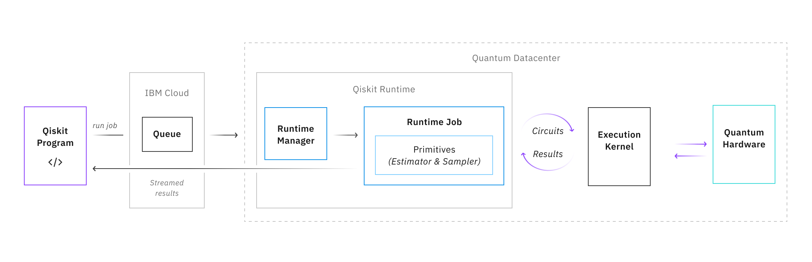

Overview
========

This document is for algorithm developers who are intending to migrate
their code to use the Qiskit Runtime execution model. Familiarity with
Qiskit and experience using a tool such as Jupyter notebooks to build
circuits will be helpful, but is not required. 

What is Qiskit Runtime?
-----------------------

Qiskit Runtime is our model for quantum computing access: enabling an
execution environment for building, optimizing, and running workloads at
scale. The platform introduces new layers of abstraction that make it
easy to access high-performance quantum computing systems, run quantum
circuits at speed, and get error-mitigated results.   Qiskit Runtime
offers a cloud-based architecture capable of delivering significant
performance improvements by bringing quantum program execution
physically close to the quantum hardware. The service uses containerized
execution environments to offer maximum operational efficiency. This
environment allows users to send jobs in a low-latency compute
environment that is tightly coupled with our quantum systems.   Qiskit
Runtime provides access to quantum computing capabilities through a set
of *primitive* programs. These programs are optimized to help users
efficiently define workloads that can extrapolate and perform
foundational quantum computing functions with improved performance.

   Figure 1. Diagram of Qiskit Runtime architecture

Primitive programs
~~~~~~~~~~~~~~~~~~

Primitive programs are predefined programs that offer users a simplified
interface for defining near-time quantum-classical workloads. They help
you efficiently build and customize quantum applications, making it easy
to build modular algorithms and higher-order programs. Additionally,
they offer seamless integration with the latest optimizations in quantum
hardware and software. For more information, see `Overview of primitive programs <https://cloud.ibm.com/docs/quantum-computing?topic=quantum-computing-overview#primitive-programs>`__. 

Sessions
~~~~~~~~

Jobs sent to Qiskit Runtime can be associated with a session. Running
jobs within a Qiskit Runtime on Cloud session means that after the first
job in a session begins, other jobs that are part of the same session
are prioritized by the scheduler, ahead of the fairshare queue.
Additionally, Qiskit Runtime primitives use other session features such
as shared caching. Shared caching is used by jobs within a session to
maximize efficiency and help users experience a faster turnaround on
results for their workload. 

For each backend that accepts reservations (not available for Qiskit
Runtime on Cloud), jobs that are part of a dedicated reservation take
priority. If there are no jobs from a provider that has a reservation,
jobs that are part of an active session are run. If there are no jobs in
an active session, the next job from the regular fair-share queue is
run.

For more information about sessions, see details in `Qiskit Runtime on IBM Cloud <https://cloud.ibm.com/docs/quantum-computing?topic=quantum-computing-sessions>`__
or `IBM Quantum Platform <https://quantum-computing.ibm.com/services/programs/docs/runtime/manage/systems/sessions/#sessions>`__.

Parameters
~~~~~~~~~~

We have isolated a number of parameters relevant to each primitive that
help users better understand their input and output data. With Qiskit
Runtime, users can send these parameters with each iteration, which
enables users to quickly execute multiple iterative loops on their
program. These pages have a comprehensive list of parameters relevant to
each primitive:

* `Sampler <https://cloud.ibm.com/docs/quantum-computing?topic=quantum-computing-program-sampler>`__
* `Estimator <https://cloud.ibm.com/docs/quantum-computing?topic=quantum-computing-program-estimator>`__

Why use Qiskit Runtime?
-----------------------

Using Qiskit Runtime unlocks the following advantages:

* Run circuits faster with our cloud-native architecture that runs close to quantum hardware in low-latency, containerized compute
 environments. This architecture leads to significant performance enhancements, especially when considering variational quantum algorithms such as VQE, where loops between classical and quantum computation can be carried out with minimized latency. 
* Use primitive programs to further abstract and simplify how you work with quantum hardware. Primitive programs provide methods that make it easier to build modular algorithms and other higher-order programs. Instead of simply returning counts, they return more immediately meaningful information. 
* Access our most powerful and exploratory quantum systems with shorter wait times by creating and running quantum programs at scale.  
* Allows seamless integrations with future functionality:

  * Expanded IBM Cloud access will allow users to couple Qiskit Runtime with other compute services while leveraging the efficiency of our quantum computing service architecture. 
  * Qiskit Runtime will continue to expand support of key capabilities that enable research with Qiskit. For example, support of the ability to iterate on existing programs by allowing users to run programs with variations inputs and configurations, and offering intermediate results to individual executions. 
  * Take advantage of seamless integration with the latest performance and hardware optimizations as we scale up and improve our offerings. With managed performance, users can quickly adopt our latest patterns and advances such as error suppression and mitigation, resulting in faster, higher-quality executions.
  * Upcoming primitive programs will allow easy access to future functionality, such as error suppression and mitigation.

.. image:: images/runtime-architecture.png
  :alt: A Qiskit Runtime job is shown, moving from a program to the queue, then to the hardware.
