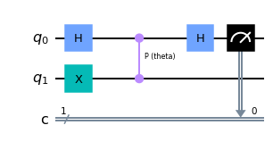
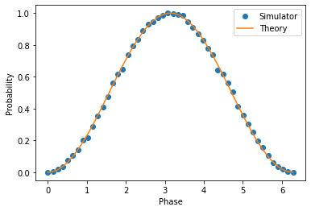
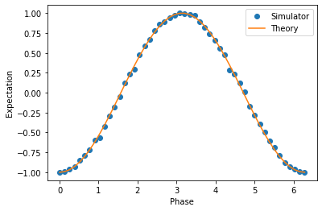
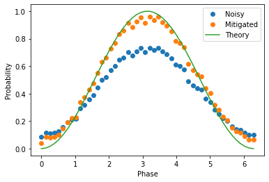
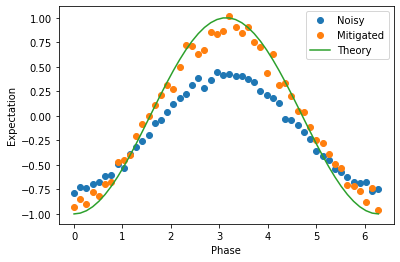

Noisy Simulators in Qiskit Runtime
==================================

This notebook shows how to setup ``ibmq_qasm_simulator`` and map a basic
noise model for an IBM Quantum hardware device in **Qiskit Runtime**, and
use this noise model to do noisy simulations of ``QuantumCircuits`` on
``Sampler`` and ``Estimator`` to study the effects of errors which occur
on real devices.

Set up your local development environment
-----------------------------------------

This tutorial requires a Qiskit Runtime service instance to be setup. If
you haven’t done so already, please follow `these
steps <https://qiskit.org/documentation/partners/qiskit_ibm_runtime/getting_started.html>`__
to set one up.

.. code-block:: python

    # load necessary Runtime libraries
    from qiskit_ibm_runtime import QiskitRuntimeService, Sampler, Estimator, Session, Options

    service = QiskitRuntimeService(channel="ibm_quantum")

Preparing the environment
-------------------------

To demonstrate the routine, we shall proceed with running an example
routine. One of the major benefits of using primitives is simplification
of binding multiple parameters in parameterized circuits. To check this,
here is an example circuit with a controlled
`P-gate <https://qiskit.org/documentation/stubs/qiskit.circuit.library.PhaseGate.html>`__
as implemented right below. Here, we parametrise the ``P-gate`` with a
rotation parameter ``theta``. To learn how to create circuits and bind
parameters to them by using Qiskit, see the `Circuit
Basics <https://qiskit.org/documentation/tutorials/circuits/01_circuit_basics.html>`__
and `Advanced
Circuits <https://qiskit.org/documentation/tutorials/circuits_advanced/01_advanced_circuits.html#Parameterized-circuits>`__
in Qiskit documentation.

.. code-block:: python

    from qiskit.circuit import Parameter
    from qiskit import QuantumCircuit

    theta = Parameter('theta')

    qc = QuantumCircuit(2,1)
    qc.x(1)
    qc.h(0)
    qc.cp(theta,0,1)
    qc.h(0)
    qc.measure(0,0)

    qc.draw('mpl')

The circuit shown above is parameterized with the eigenvalue being
kicked back into qubit 0 to be measured. The amount of kickback will be
determined by the parameter theta. Now in the cell below, we shall
define our parameters for our above circuit as a list. The parameters
here will be from :math:`0` to :math:`2\pi` divided over 50 evenly
spaced points.

.. code-block:: python

    import numpy as np

    phases = np.linspace(0, 2*np.pi, 50)

    # phases need to be expressed as a list of lists in order to work
    individual_phases = [[phase] for phase in phases]

Running on the ideal simulator
------------------------------

Set the backend and options to use
~~~~~~~~~~~~~~~~~~~~~~~~~~~~~~~~~~

First we shall demonstrate a run using an ideal case without any
``noise_model``, ``optimization_level`` or ``resilience_level`` for both
Sampler and Estimator. We shall proceed to setup the options as shown
below:

.. code-block:: python

    backend = "ibmq_qasm_simulator" # use the simulator

.. code-block:: python

    options = Options()
    options.simulator.seed_simulator = 42
    options.execution.shots = 1000
    options.optimization_level = 0 # no optimization
    options.resilience_level = 0 # no error mitigation

Run the circuits on Sampler
~~~~~~~~~~~~~~~~~~~~~~~~~~~

We shall now sample the circuit to get the result probability
distribution. We shall be utilizing the `Sampler
primitive <https://qiskit.org/documentation/partners/qiskit_ibm_runtime/stubs/qiskit_ibm_runtime.Sampler.html>`__
to do the same. To learn how to use the ``Sampler`` primitive and how to
get started using Qiskit Runtime Sessions, you can check this tutorial:
`Get started with the Sampler
primitive <https://qiskit.org/documentation/partners/qiskit_ibm_runtime/tutorials/how-to-getting-started-with-sampler.html>`__.

.. code-block:: python

    with Session(service=service, backend=backend):
        sampler = Sampler(options=options)
        job = sampler.run(
            circuits=[qc]*len(phases),
            parameter_values=individual_phases
        )
        result = job.result()

.. code-block:: python

    import matplotlib.pyplot as plt

    # the probablity of being in the 1 state for each of these values
    prob_values = [dist.get(1, 0) for dist in result.quasi_dists]

    plt.plot(phases, prob_values, 'o', label='Simulator')
    plt.plot(phases, np.sin(phases/2,)**2, label='Theory')
    plt.xlabel('Phase')
    plt.ylabel('Probability')
    plt.legend()

.. parsed-literal::

    <matplotlib.legend.Legend at 0x7f7fd233b6d0>

Run the circuits on Estimator
~~~~~~~~~~~~~~~~~~~~~~~~~~~~~

To learn how to start a session for Estimator, you may check this
tutorial: `Get started with the Estimator
primitive <https://qiskit.org/documentation/partners/qiskit_ibm_runtime/tutorials/how-to-getting-started-with-estimator.html>`__.

The Estimator will bind single-qubit rotations to get hamiltonians
before it returns expectation values of quantum operators. Therefore,
the circuit doesn’t require any measurements. Currently the circuit
``qc`` has measurements so we will remove these with
``remove_final_measurements``.

.. code-block:: python

    qc_no_meas = qc.remove_final_measurements(inplace=False)
    qc_no_meas.draw('mpl')

.. image:: ../images/noisy-sim-estimator-circuit.png

.. code-block:: python

    from qiskit.quantum_info import SparsePauliOp

    ZZ = SparsePauliOp.from_list([("ZZ", 1)])
    print(f"  > Observable: {ZZ.paulis}")

.. parsed-literal::

      > Observable: ['ZZ']

With this observable, the expectation value is calculated by the
equation below.

.. math::

   \langle ZZ\rangle =\langle \psi | ZZ | \psi\rangle=\langle \psi|(|0\rangle\langle 0| -|1\rangle\langle 1|)\otimes(|0\rangle\langle 0| - |1\rangle\langle 1|) |\psi\rangle =|\langle 00|\psi\rangle|^2 - |\langle 01 | \psi\rangle|^2 - |\langle 10 | \psi\rangle|^2 + |\langle 11|\psi\rangle|^2

The next cell will implement the above as shown.

.. code-block:: python

    with Session(service=service, backend=backend):
        estimator = Estimator(options=options)
        job = estimator.run(
            circuits=[qc_no_meas]*len(phases),
            parameter_values=individual_phases,
            observables=[ZZ]*len(phases)
        )
        result = job.result()

.. code-block:: python

    exp_values = result.values

    plt.plot(phases, exp_values, 'o', label='Simulator')
    plt.plot(phases, 2*np.sin(phases/2)**2-1, label='Theory')
    plt.xlabel('Phase')
    plt.ylabel('Expectation')
    plt.legend()

.. parsed-literal::

    <matplotlib.legend.Legend at 0x7f7fd0ed8820>

Running a noisy simulation
--------------------------

Now we’ll setup our simulator to run a noisy simulation rather than the
ideal one. We can pass a custom ``noise_model`` to the simulator on
Runtime by specifying it in the ``Options`` parameter. Here we will try
to mimic a real backend and map on the noise_model from a
``FakeBackend`` class. The noise model can be extracted from the
``FakeBackend`` and passed as a ``simulator`` parameter in options. If
you want to know more about ``fake_provider``, check `Fake
Provider <https://qiskit.org/documentation/apidoc/providers_fake_provider.html>`__
in Qiskit documentation.

Since we are trying to mimic a real backend, we can also pass in the
``coupling_map`` that the backend topology has and the ``basis_gates``
that the backend supports to have a more realistic noisy simulation.

.. code-block:: python

    from qiskit.providers.fake_provider import FakeManila
    from qiskit_aer.noise import NoiseModel

    # Make a noise model
    fake_backend = FakeManila()
    noise_model = NoiseModel.from_backend(fake_backend)

    # Set options to include the noise model
    options = Options()
    options.simulator = {
        "noise_model": noise_model,
        "basis_gates": fake_backend.configuration().basis_gates,
        "coupling_map": fake_backend.configuration().coupling_map,
        "seed_simulator": 42
    }

    # Set number of shots, optimization_level and resilience_level
    options.execution.shots = 1000
    options.optimization_level = 0
    options.resilience_level = 0

The ``ibmq_qasm_simulator`` allows for the activation of the
``resilience_levels`` offered by the Qiskit Runtime Service, and use of
these levels on simulators is best demonstrated using the noisy
simulation as we have described above.

To see the comparision, we shall define two set of ``Options``. The ibmq
qasm simulator allows for the activation of the resilience levels
offered by Qiskit Runtime, and the use of these levels on simulators is
best demonstrated using the noisy simulation that we have built. Here,
``options`` is set to\ ``resilience level`` = ``0`` to represent a
normal run without error mitigation, and ``options with em`` is set to
``resilience level`` = ``1`` to represent a run with error mitigation
enabled.

.. code-block:: python

    # Set options to include the noise model with error mitigation
    options_with_em = Options()
    options_with_em.simulator = {
        "noise_model": noise_model,
        "basis_gates": fake_backend.configuration().basis_gates,
        "coupling_map": fake_backend.configuration().coupling_map,
        "seed_simulator": 42
    }

    # Set number of shots, optimization_level and resilience_level
    options_with_em.execution.shots = 1000
    options_with_em.optimization_level = 0 # no optimization
    options_with_em.resilience_level = 1 # M3 for Sampler and T-REx for Estimator

When you set the ``resilience_level`` to 1, M3 is activated in Sampler.
All available resilience level configurations can be found
`here <https://qiskit.org/documentation/partners/qiskit_ibm_runtime/how_to/error-mitigation.html>`__.

.. code-block:: python

    with Session(service=service, backend=backend):
        # include the noise model without M3
        sampler = Sampler(options=options)
        job = sampler.run(
            circuits=[qc]*len(phases),
            parameter_values=individual_phases
        )
        result = job.result()
        prob_values = [1-dist[0] for dist in result.quasi_dists]

        # include the noise model with M3
        sampler = Sampler(options=options_with_em)
        job = sampler.run(
            circuits=[qc]*len(phases),
            parameter_values=individual_phases
        )
        result = job.result()
        prob_values_with_em = [1-dist[0] for dist in result.quasi_dists]

.. code-block:: python

    plt.plot(phases, prob_values, 'o', label='Noisy')
    plt.plot(phases, prob_values_with_em, 'o', label='Mitigated')
    plt.plot(phases, np.sin(phases/2,)**2, label='Theory')
    plt.xlabel('Phase')
    plt.ylabel('Probability')
    plt.legend()

.. parsed-literal::

    <matplotlib.legend.Legend at 0x7f7fb4230700>

``T-REx`` is triggered in Estimator when the resilience level is set to
1.

.. code-block:: python

    with Session(service=service, backend=backend):
        # include the noise model without T-REx
        estimator = Estimator(options=options)
        job = estimator.run(
            circuits=[qc_no_meas]*len(phases),
            parameter_values=individual_phases,
            observables=[ZZ]*len(phases)
        )
        result = job.result()
        exp_values = result.values

        # include the noise model with T-REx
        estimator = Estimator(options=options_with_em)
        job = estimator.run(
            circuits=[qc_no_meas]*len(phases),
            parameter_values=individual_phases,
            observables=[ZZ]*len(phases))
        result = job.result()
        exp_values_with_em = result.values

.. code-block:: python

    plt.plot(phases, exp_values, 'o', label='Noisy')
    plt.plot(phases, exp_values_with_em, 'o', label='Mitigated')
    plt.plot(phases, 2*np.sin(phases/2)**2-1, label='Theory')
    plt.xlabel('Phase')
    plt.ylabel('Expectation')
    plt.legend()

.. parsed-literal::

    <matplotlib.legend.Legend at 0x7f7f7006ca00>

Resilience levels are currently in beta so sampling overhead and
solution quality will vary from circuit to circuit. New features,
advanced options and management tools will be released on a rolling
basis. You can also play around wtih higher levels of resilience and
explore additional options offered by them. If you wish to learn more
about activating features like *Digital-ZNE*, *PEC* in addition to *M3*
and *T-REx* as shown in the examples above, check out this tutorial:
`Error supression and error mitigation with Qiskit
Runtime <https://qiskit.org/documentation/partners/qiskit_ibm_runtime/tutorials/Error-Suppression-and-Error-Mitigation.html>`__.

.. code-block:: python

    import qiskit_ibm_runtime
    qiskit_ibm_runtime.version.get_version_info()

.. parsed-literal::

    '0.8.0'

.. code-block:: python

    from qiskit.tools.jupyter import *
    %qiskit_version_table

.. raw:: html

    <h3>Version Information</h3><table><tr><th>Qiskit Software</th><th>Version</th></tr><tr><td><code>qiskit-terra</code></td><td>0.22.2</td></tr><tr><td><code>qiskit-aer</code></td><td>0.11.1</td></tr><tr><td><code>qiskit-ibmq-provider</code></td><td>0.19.2</td></tr><tr><td><code>qiskit</code></td><td>0.39.2</td></tr><tr><td><code>qiskit-nature</code></td><td>0.5.0</td></tr><tr><td><code>qiskit-finance</code></td><td>0.3.4</td></tr><tr><td><code>qiskit-optimization</code></td><td>0.4.0</td></tr><tr><td><code>qiskit-machine-learning</code></td><td>0.5.0</td></tr><tr><th>System information</th></tr><tr><td>Python version</td><td>3.8.13</td></tr><tr><td>Python compiler</td><td>GCC 10.3.0</td></tr><tr><td>Python build</td><td>default, Mar 25 2022 06:04:10</td></tr><tr><td>OS</td><td>Linux</td></tr><tr><td>CPUs</td><td>8</td></tr><tr><td>Memory (Gb)</td><td>31.211326599121094</td></tr><tr><td colspan='2'>Wed Nov 30 02:43:41 2022 UTC</td></tr></table>

