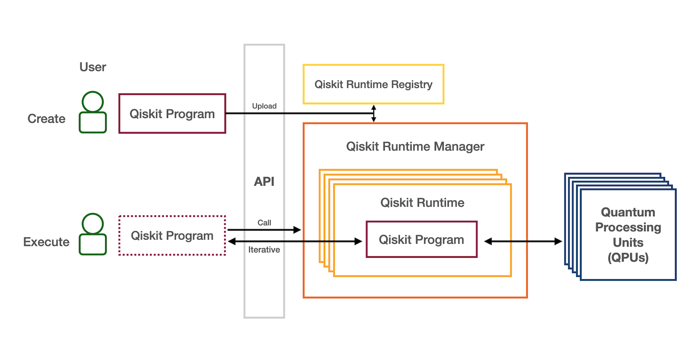

##########################
Qiskit Runtime (|version|)
##########################

.. important:: 

    The Qiskit Runtime is currently in beta mode and is available on
    select IBM Quantum systems and simulators to all premium users.
    But check back, as we’ll be releasing it publicly soon!

The Qiskit Runtime is a new execution model / architecture that markedly reduces
IO overhead when submitting applications and algorithms to quantum processors that
require many iterations of circuit executions and classical processing.  Programs of this
category are common, and span a wide variety of application spaces including chemistry,
machine learning, and optimization.  

In general, most users of the Qiskit Runtime execute programs that are predefined
and specified using a program name and a small number of input arguments, e.g.:

.. code-block:: python

    program_inputs = {'circuits': circuit,
                      'optimization_level': 3
                     }
    options = {'backend_name': backend.name()}
    job = provider.runtime.run(program_id="circuit-runner",
                               options=options,
                               inputs=program_inputs,
                              )
 
It is also possible to define custom programs and upload them to the Cloud infrastructure,
although access to this functionality is limited at present.

For additional information and usage examples see the :ref:`tutorials` page and the
`IBM Quantum Runtime documentation <https://quantum-computing.ibm.com/lab/docs/iql/runtime/>`_.

.. toctree::
    :hidden:

    self
    Getting starting <getting_started>
    Current runtime limitations <limitations>

.. toctree::
    :maxdepth: 1
    :caption: Example programs
    :hidden:
  
    Circuit runner <example_scripts/circuit_runner>
    Quantum Kernel Alignment <example_scripts/qka>
