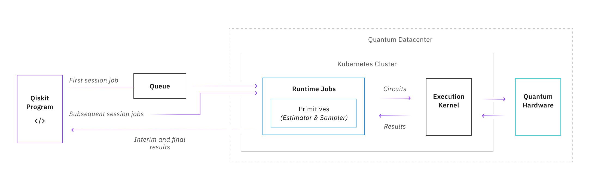

#########################################
Qiskit Runtime overview
#########################################

Overview
==============

Qiskit Runtime is a quantum computing service and programming model that allows users to
optimize workloads and efficiently execute them on quantum systems at scale. The
programming model extends the existing interface in Qiskit with a set of new primitive
programs.

Key concepts
==============

**Primitives**

Primitives are core functions that provide a simplified interface for defining near-time quantum-classical workloads required to efficiently build and customize applications. The initial release of Qiskit Runtime includes two primitives: Estimator and Sampler. They perform foundational quantum computing tasks and act as an entry point to the Qiskit Runtime service.

**Estimator**

The estimator primitive allows users to efficiently calculate and interpret expectation
values of quantum operators required for many algorithms. Users specify a list of circuits
and observables, then tell the program how to selectively group between the lists to
efficiently evaluate expectation values and variances for a given parameter input.

**Sampler**

This primitive takes a user circuit as an input and generates an error-mitigated
readout of quasiprobabilities. This provides users a way to better evaluate shot results
using error mitigation and enables them to more efficiently evaluate the possibility of
multiple relevant data points in the context of destructive interference.

Next steps
=================================

`Getting started <getting_started.html>`_

`Tutorials <tutorials.html>`_

.. toctree::
   :maxdepth: 1
   :hidden:
   :caption: Get started

    Overview <self>
    Getting Started <getting_started>
    backend.run vs. Qiskit Runtime <compare>
    Introduction to primitives <primitives>
    Migration guide from qiskit-ibmq-provider <migrate_from_ibmq>

.. toctree::
   :maxdepth: 1
   :hidden:
   :caption: Tutorials

    Get started with Estimator <tutorials/how-to-getting-started-with-estimator>
    Get started with error suppression and error mitigation <tutorials/Error-Suppression-and-Error-Mitigation>
    VQE with Estimator <tutorials/vqe_with_estimator>
    CHSH with Estimator <tutorials/chsh_with_estimator>
    Get started with Sampler <tutorials/how-to-getting-started-with-sampler>
    QPE with Sampler <tutorials/qpe_with_sampler>
    Grover with Sampler <tutorials/grover_with_sampler>
    SEA with Sampler <tutorials/sea_with_sampler>
    Submit user-transpiled circuits using primitives <tutorials/user-transpiled-circuits>
    All tutorials <tutorials>

.. toctree::
   :maxdepth: 1
   :hidden:
   :caption: How to

    Run a session <how_to/run_session>
    Run on quantum backends <how_to/backends>
    Retrieve job results <how_to/retrieve_results>
    Configure primitive options <how_to/options>
    Configure error mitigation options <how_to/error-mitigation>
    Configure error suppression <how_to/error-suppression>
    Manage your account <how_to/account-management>
    Run noisy simulations <how_to/noisy_simulators>

.. toctree::
   :maxdepth: 1
   :hidden:
   :caption: Migrate

    Migrate to using Qiskit Runtime primitives <migrate/migrate-guide>
    Use Estimator to design an algorithm <migrate/migrate-estimator>
    Use Sampler to design an algorithm <migrate/migrate-sampler>
    Update parameter values while running <migrate/migrate-update-parm>
    Work with updated Qiskit algorithms <migrate/migrate-qiskit-alg>
    Algorithm tuning options (shots, transpilation, error mitigation) <migrate/migrate-tuning> 

.. toctree::
   :maxdepth: 1
   :hidden:
   :caption: Work with Qiskit Runtime in IBM Cloud

    Getting started <cloud/quickstart>
    Pricing plans <cloud/plans>
    Plan for an organization <cloud/quickstart-org>
    Configure for an organization <cloud/quickstart-steps-org>
    Manage users in an organization <cloud/cloud-provider-org>
    Manage the cost <cloud/cost>
    Set up Terraform <cloud/setup-terraform>
    Architecture and workload isolation <cloud/architecture-workload-isolation>
    Securing your data <cloud/data-security>
    Audit events <cloud/at-events>

.. toctree::
   :maxdepth: 1
   :hidden:
   :caption: Reference

    API Reference <apidocs/ibm-runtime>
    Swagger API for building applications that use Qiskit Runtime <https://us-east.quantum-computing.cloud.ibm.com/openapi/>
    API error codes <errors>
    FAQs <faqs>
    Retired systems <retired>
    Release Notes <release_notes>
    GitHub <https://github.com/Qiskit/qiskit-ibm-runtime>

.. Hiding - Indices and tables
   :ref:`genindex`
   :ref:`modindex`
   :ref:`search`
