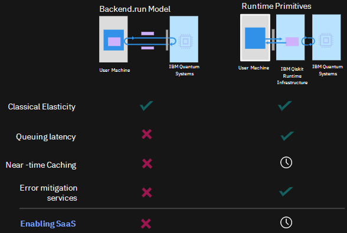

Migration guide
===========================================

.. _why-migrate:

Why use the Qiskit Runtime execution model?
--------------------------------------------

Using Qiskit Runtime unlocks the following advantages:

* Access our most powerful quantum systems with shorter wait times.

  * Run circuits faster with our containerized, cloud-native architecture. 
  * Especially helpful for variational quantum algorithms, where loops between classical and quantum computation can be carried out with minimized latency.
  * Decrease total time from start to finish. 

* Use primitive programs write code more efficiently

  +-------------------------------------------------------------------------------------------------------------------------------------------------------------------------------------------------------------------------------------------------------------------------------------------------------------------------------------------------------------------------------------------------------------------------------------------------------------------------------------------------------------------------------------------------------------------------------------------------------------------------------------------------------------------------------------------------------------------------------------------------------------------------------------------------------------------------------------------------------------------------------------------------------------------------------------------------------------------------------------------------------------------------------------------------------------------------------------------------------------------------------------------------------------------------------------------------------------------------------------------------------------------------------------------------------------------------------------------------------------------------------------------------------------------------------------------------------------------------------------------------------------------------------------------------------+-------------------------------------------------------------------------------------------------------------------------------------------------------------------------------------------------------------------------------------------------------------------------------------------------------------------------------------------------------------------------------------------------------------------------------------------------------------------------------------------------------------------------------------------------------------------------------------------------------------------------------------------------------------------------------------------------------------------------------------------------------------------------------------------------------------------------------------------------------------------------------------------------------------------------------------------+
|  Without primitives                                                                                                                                                                                                                                                                                                                                                                                                                                                                                                                                                                                                                                                                                                                                                                                                                                                                                                                                                                                                                                                                                                                                                                                                                                                                                                                                                                                                                                                                                                                                   |  With primitives                                                                                                                                                                                                                                                                                                                                                                                                                                                                                                                                                                                                                                                                                                                                                                                                                                                                                                                          |
+=======================================================================================================================================================================================================================================================================================================================================================================================================================================================================================================================================================================================================================================================================================================================================================================================================================================================================================================================================================================================================================================================================================================================================================================================================================================================================================================================================================================================================================================================================================================================================================+===========================================================================================================================================================================================================================================================================================================================================================================================================================================================================================================================================================================================================================================================================================================================================================================================================================================================================================================================================+
| 

```python
{
   from qiskit.providers import Backend
   from qiskit.utils import QuantumInstance
   from qiskit.opflow import CircuitSampler, ExpectationBase, StateFn
   from typing import Optional, Union
   from qiskit import QuantumCircuit

   class QuantumFidelityAlgorithm:

       def __init__(
           self,
           ...,
           expectation: BaseExpectation,
           quantum_instance: Optional[Union[QuantumInstance, Backend]],
       ) -> None:
           if not isinstance(quantum_instance, QuantumInstance):
               quantum_instance = QuantumInstance(quantum_instance)
           self.sampler = CircuitSampler(quantum_instance)

       def _construct_state1(self, ...) -> QuantumCircuit:
           pass
       def _construct_state2(self, ...) -> QuantumCircuit:
           pass
       def run_fidelity_algorithm(self, ...):

           state1 = self._construct_state1(...)
           state2 = self._construct_state2(...)

           values1 = np.random.random(circuit.num_parameters)
           values2 = np.random.random(circuit.num_parameters)

           bound_state_circuit1 = state1.assign_parameters(values1)
           bound_state_circuit2 = state2.assign_parameters(values2)

           overlap = StateFn(bound_state_circuit1).adjoint() @ StateFn(bound_state_circuit2)

           converted_overlap = self.expectation.convert(overlap)

           sampled_overlap = self.sampler.convert(converted_overlap)

           return sampled_overlap.eval()
}
```

  | 

```python
{
   from qiskit.algorithms.state_fidelities import BaseStateFidelity
   from qiskit import QuantumCircuit

   #fidelity = ComputeUncompute(Sampler())
   class QuantumFidelityAlgorithm:

       def __init__(
           self,
           ...,
           fidelity: BaseStateFidelity,
       ) -> None:
           pass
       def _construct_state1(self, ...) -> QuantumCircuit:
           pass
       def _construct_state2(self, ...) -> QuantumCircuit:
           pass
       def run_fidelity_algorithm(self, ...):

           state1 = self._construct_state1(...)
           state2 = self._construct_state2(...)

           values1 = np.random.random(circuit.num_parameters)
           values2 = np.random.random(circuit.num_parameters)

           job = self.fidelity.run([state1], [state2], [values1], [values2])
           fidelity = job.result().fidelities

           return fidelity
}
```

  |
+-------------------------------------------------------------------------------------------------------------------------------------------------------------------------------------------------------------------------------------------------------------------------------------------------------------------------------------------------------------------------------------------------------------------------------------------------------------------------------------------------------------------------------------------------------------------------------------------------------------------------------------------------------------------------------------------------------------------------------------------------------------------------------------------------------------------------------------------------------------------------------------------------------------------------------------------------------------------------------------------------------------------------------------------------------------------------------------------------------------------------------------------------------------------------------------------------------------------------------------------------------------------------------------------------------------------------------------------------------------------------------------------------------------------------------------------------------------------------------------------------------------------------------------------------------+-------------------------------------------------------------------------------------------------------------------------------------------------------------------------------------------------------------------------------------------------------------------------------------------------------------------------------------------------------------------------------------------------------------------------------------------------------------------------------------------------------------------------------------------------------------------------------------------------------------------------------------------------------------------------------------------------------------------------------------------------------------------------------------------------------------------------------------------------------------------------------------------------------------------------------------------+


  .. figure:: ../images/compare-code.png
   :scale: 50 %
   :alt: Two code snippets, side by side

   Code without primitives, and the same code after being rewritten to use primitives.

  * Seamlessly access our latest performance and hardware optimizations.

* Combine with IBM Cloud access to couple Qiskit Runtime with other compute services.


The following image compares the execution paths and function availablilty for backend.run compared to the Qiskit Runtime execution model. Items marked with a clock are coming soon.



 Comparing backend.run to the Qiskit Runtime execution model. 


.. _migfaqs:

FAQs
--------------------------------------------

Users might have the followings questions when planning to migrate their
code to Qiskit Runtime.

.. raw:: html

  <details>
  <summary>Which channel should I use?</summary>

After deciding to use Qiskit Runtime primitives, the user must first decide whether their needs are better suited to using Qiskit Runtime
through IBM Cloud or IBM Quantum Platform.  Some information that might help in making this decision include:

* The available plans:

  * Qiskit Runtime is available in both the Open or Premium plan of the IBM Quantum Platform. See `IBM Quantum access plans <https://www.ibm.com/quantum/access-plans>`__ for details.
  * Qiskit Runtime is accessible through the Lite or Standard plan in IBM Cloud. See `Plans <../cloud/plans.html>`__ for details.

* The use case requirements:

  * IBM Quantum Platform offers a visual circuit composer (Quantum Composer) and a Jupyter Notebook environment (Quantum Lab).
  * IBM Cloud offers a cloud native service that is ideal if users need to integrate quantum capabilities with other cloud services.

.. raw:: html

   </details>

.. raw:: html

  <details>
  <summary>How do I set up my channel?</summary>

After deciding which channel to use to interact with Qiskit Runtime, you
can get set up on either platform using the instructions below:

To get started with Qiskit Runtime on IBM Quantum Platform, see
`Experiment with Qiskit Runtime <https://quantum-computing.ibm.com/services/resources/docs/resources/runtime/start>`__.

To get started with Qiskit Runtime on IBM Cloud, see the `Getting Started guide <../cloud/quickstart.html>`__.

.. raw:: html

   </details>

.. raw:: html

  <details>
  <summary>Should I modify the Qiskit Terra algorithms?</summary>

As of v0.22, `Qiskit Terra algorithms <https://github.com/Qiskit/qiskit-terra/tree/main/qiskit/algorithms>`__ use Qiskit Runtime primitives. Thus, there is no need for
users to modify amplitude estimators or any other Qiskit Terra
algorithms.

.. raw:: html

   </details>

.. raw:: html

  <details>
  <summary>Which primitive should I use?</summary>

When choosing which primitive to use, we first need to understand
whether our algorithm is supposed to use a quasi-probability
distribution sampled from a quantum state (a list of
quasi-probabilities), or an expectation value of a certain observable
with respect to a quantum state (a real number).

A probability distribution is often of interest in optimization problems
that return a classical bit string, encoding a certain solution to a
problem at hand. In these cases, we might be interested in finding a bit
string that corresponds to a ket value with the largest probability of
being measured from a quantum state, for example.

An expectation value of an observable could be the target quantity in
scenarios where the knowledge of a quantum state is not relevant. This
often occurs in optimization problems or chemistry applications, where
the extremal energy of a system is to be discovered, for example.

.. raw:: html

   </details>

.. raw:: html

  <details>
  <summary>Which parts of my code do I need to refactor?</summary>

Replace all dependencies on ``QuantumInstance`` and ``Backend`` with the
implementation of the ``BaseEstimator``, ``BaseSampler``, or both
primitives from the ``qiskit_ibm_runtime`` library.

It is also possible to use local implementations, as shown in the
`Amplitude estimation use case <migrate-e2e#amplitude>`__.

Notably, for common scenarios it is not necessary to handle backends
differently nor to construct expressions for expectation values
manually.
.. raw:: html

   </details>

.. _migrate-code:

Migrate code
--------------------------------------------

We have identified key patterns of behavior and use cases with code examples to help you migrate code to Qiskit
Runtime.

.. note::

   The key to writing an equivalent algorithm using Qiskit Runtime primitives is to remove all dependencies on ``QuantumInstance`` and ``Backend`` and replacing them with the implementation of the Estimator, Sampler, or both primitives from the ``qiskit_ibm_runtime`` library.

It is also possible to use local implementations, as shown in the
`Amplitude estimation use case <migrate-e2e#amplitude.html>`__.

Notably, for common scenarios it is not necessary to handle backends
differently nor to construct expressions for expectation values
manually.

The following topics are use cases with code migration examples:

* `Use Estimator in an algorithm <migrate-estimator.html>`__
* `Use Sampler in an algorithm <migrate-sampler.html>`__
* `Use Estimator and Sampler in an algorithm <migrate-est-sam.html>`__
* `Update parameter values while running <migrate-update-parm.html>`__
* `Primitive-based routines <migrate-prim-based.html>`__
* `End-to-end example <migrate-e2e.html>`__


Related links
-------------

* `Use Estimator in an algorithm <../tutorials/how-to-getting-started-with-estimator>`__
* `Use Sampler in an algorithm <../tutorials/how-to-getting-started-with-sampler>`__
