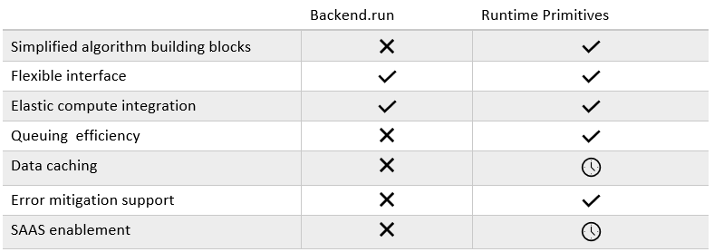

Migration guide
================

This guide describes key patterns of behavior and use cases with code examples to help you migrate code from
the legacy ``qiskit-ibmq-provider`` package to use the Qiskit Runtime primitives.

The primitives are the recommended tool to write quantum algorithms, as they encapsulate common device queries
seen in application packages, and allow for managed performance through the Qiskit Runtime service.
However, if your algorithm requires more granular information, such as pre-shot measurements, the primitives might
not provide the desired abstraction level. You can refer to the restructured ``qiskit-ibm-provider`` package,
and its corresponding
`migration guide <https://qiskit.org/documentation/partners/qiskit_ibm_provider/tutorials/Migration_Guide_from_qiskit-ibmq-provider.html>`_
for further information on alternatives to the Qiskit Runtime primitives.

The Qiskit Runtime primitives implement the reference ``Sampler`` and ``Estimator`` interfaces found in
`qiskit.primitives <https://qiskit.org/documentation/apidoc/primitives.html>`_. These interfaces let you 
switch between primitive implementations with minimal code changes. Different primitive implementations
can be found in the ``qiskit``, ``qiskit_aer``, and ``qiskit_ibm_runtime`` library.
Each implementation serves a specific purpose:

* The primitives in ``qiskit`` can perform local state vector simulations - useful for quickly prototyping algorithms. 
* The primitives in ``qiskit_aer`` give access to the local Aer simulators for tasks such as noisy simulation. 
* The primitives in ``qiskit_ibm_runtime`` provide access to cloud simulators and real hardware through the Qiskit
  Runtime service. They include exclusive features such as built-in circuit optimization and error mitigation support.

.. attention::

    The **only primitives that provide access to the Qiskit Runtime service** are those imported
    from ``qiskit_ibm_runtime`` (Qiskit Runtime Primitives).

When migrating, the key to writing an equivalent algorithm using primitives is to first identify what is the minimal
unit of information your algorithm is based on:

* If it uses an **expectation value**, you will need an ``Estimator``.
* If it uses a **probability distribution** (from sampling the device), you will need a ``Sampler``.

After determining which primitive to use, identify where the algorithm accesses the backend. Look for the call to
``backend.run()``.
Next, you will replace this call with the respective primitive call, as shown in the following examples.

.. note::

   Some qiskit libraries provide their own ``backend.run()`` wrappers, for example: ``QuantumInstance``,
   formerly used in ``qiskit.algorithms``. To migrate code that has such dependencies, replace the execution
   method with the corresponding primitive. 
   
..
   Add this in later when it's done and we have the link
   For instructions to migrate code based on ``QuantumInstance``, refer to the `Quantum Instance migration guide <http://qisk.it/qi_migration>`__.
   

This guide has examples for two basic types of users:

* Algorithm developers who need to refactor algorithms to use primitives instead of `backend.run` should refer to these topics:

   * `Update code that performs circuit sampling <migrate-sampler.html>`__
   * `Update code that calculates expectation values <migrate-estimator.html>`__
   
* Algorithm users that refer to Qiskit algorithms but do not directly use primitives.  These users now need to pass in a primitive instead of a backend to the updated Qiskit algorithms.  Refer to this topic for details:

   * `Work with updated Qiskit algorithms <migrate-qiskit-alg.html>`__

The following topics are use cases with code migration examples:

* `Update parameter values while running <migrate-update-parm.html>`__
* `Algorithm tuning options (shots, transpilation, error mitigation) <migrate-e2e.html>`__

.. _why-migrate:

Why use Qiskit Runtime?
--------------------------------------------

**Benefits of using Qiskit Runtime**:

* Simplify algorithm design and optimization. 
* Run circuits faster by using sessions - a context manager designed to efficiently manage iterative workloads and minimize artificial latency between quantum and classical sub-components.
* Access our most powerful quantum systems with our latest performance and hardware optimization, including capabilities like error suppression and mitigation.
* Easily integrate Qiskit Runtime with your cloud or on-premise classical compute resources by using the quantum serverless toolkit.

**Simplified interface**:

Use primitive programs to write code more efficiently.  For details, see the examples topics, such as `Using Estimator to design an algorithm <migrate-estimator>`__.

  .. figure:: ../images/compare-code.png
   :scale: 50 %
   :alt: Two code snippets, side by side
   :target: migrate-prim-based

   Code without primitives, and the same code after being rewritten to use primitives.

.. _migfaqs:

FAQs
--------------------------------------------

Users might have the following questions when planning to migrate their
code to Qiskit Runtime:

.. raw:: html

  

  
Which channel should I use?

After deciding to use Qiskit Runtime primitives, the user must determine whether to access Qiskit Runtime
through IBM Cloud or IBM Quantum Platform.  Some information that might help you decide includes:

* The available plans:

  * Qiskit Runtime is available in both the Open (free access) or Premium (contract-based paid access) plan on IBM Quantum Platform. See `IBM Quantum access plans <https://www.ibm.com/quantum/access-plans>`__ for details.
  * Qiskit Runtime is accessible through the Lite (free access) or Standard (pay-as-you-go access) plan in IBM Cloud. See `Plans <../cloud/plans.html>`__ for details.

* The use case requirements:

  * IBM Quantum Platform offers a visual circuit composer (Quantum Composer) and a Jupyter Notebook environment (Quantum Lab).
  * IBM Cloud offers a cloud native service that is ideal if users need to integrate quantum capabilities with other cloud services.

.. raw:: html

   

.. raw:: html

  

  
How do I set up my channel?

After deciding which channel to use to interact with Qiskit Runtime, you
can get set up on either platform using the instructions below:

* To get started with Qiskit Runtime on IBM Quantum Platform, see `Experiment with Qiskit Runtime <https://quantum-computing.ibm.com/services/resources/docs/resources/runtime/start>`__.
* To get started with Qiskit Runtime on IBM Cloud, see the `Getting Started guide <../cloud/get-started.html>`__.

.. raw:: html

   

.. raw:: html

  

  
Should I modify the Qiskit Terra algorithms?

As of v0.22, `Qiskit Terra algorithms <https://github.com/Qiskit/qiskit-terra/tree/main/qiskit/algorithms>`__ use Qiskit Runtime primitives. Thus, there is no need for
users to modify amplitude estimators or any other Qiskit Terra algorithms.

.. raw:: html

   

.. raw:: html

  

  
Which primitive should I use?

When choosing which primitive to use, you first need to understand
whether the algorithm uses a **quasi-probability distribution** sampled from a quantum state (a list of
quasi-probabilities), or an **expectation value*** of a certain observable
with respect to a quantum state (a real number).

A probability distribution is often of interest in optimization problems
that return a classical bit string, encoding a certain solution to a
problem at hand. In these cases, you might be interested in finding a bit
string that corresponds to a ket value with the largest probability of
being measured from a quantum state, for example.

An expectation value of an observable could be the target quantity in
scenarios where knowing a quantum state is not relevant. This
often occurs in optimization problems or chemistry applications.  For example, when trying to discover the extremal energy of a system.

.. raw:: html

   

.. raw:: html

  

  
Which parts of my code do I need to refactor?

Replace all dependencies on ``QuantumInstance`` and ``Backend`` with the
implementation of the ``Estimator``, ``Sampler``, or both
primitives from the ``qiskit_ibm_runtime`` library.

It is also possible to use local implementations, as shown in the
`Amplitude estimation use case <migrate-e2e#amplitude>`__.

.. code-block:: python

    def get_evaluate_energy_vqe(
        self,
        ansatz: QuantumCircuit,
        operator: OperatorBase,
        return_expectation: bool = False,
    ) -> Callable[[np.ndarray], np.ndarray | float]:

        num_parameters = ansatz.num_parameters
        ansatz_params = ansatz.parameters

        expect_op, expectation = self.construct_expectation(
            ansatz_params, operator, return_expectation=True
        )

        def evaluate_energy(parameters: np.ndarray):

            parameter_sets = np.reshape(parameters, (-1, num_parameters))
            # Create dict associating each parameter with the lists of parameterization values for it
            param_bindings = dict(zip(ansatz_params, parameter_sets.transpose().tolist()))

            sampled_expect_op = self._circuit_sampler.convert(expect_op, params=param_bindings)
            means = np.real(sampled_expect_op.eval())

            return means if len(means) > 1 else means[0]

        if return_expectation:
            return energy_evaluation, expectation

        return energy_evaluation

.. code-block:: python

    def _get_evaluate_energy_vqe_primitives(
            self,
            ansatz: QuantumCircuit,
            operator: BaseOperator | PauliSumOp,
        ) -> Callable[[np.ndarray], np.ndarray | float]:

        num_parameters = ansatz.num_parameters

        def evaluate_energy(parameters: np.ndarray):

            parameters = np.reshape(parameters, (-1, num_parameters)).tolist()
            batch_size = len(parameters)

            job = self.estimator.run(batch_size * [ansatz], batch_size * [operator], parameters)
            estimator_result = job.result()
            values = estimator_result.values

            return values[0] if len(values) == 1 else values

         return evaluate_energy

.. raw:: html

   

Related links
-------------

* `Get started with Estimator <../tutorials/how-to-getting-started-with-estimator>`__
* `Get started with Sampler <../tutorials/how-to-getting-started-with-sampler>`__
