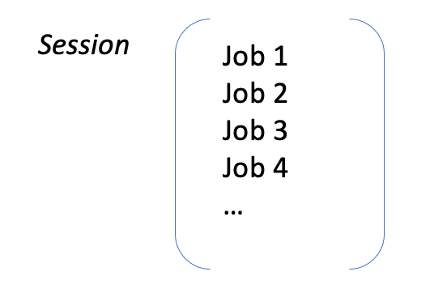
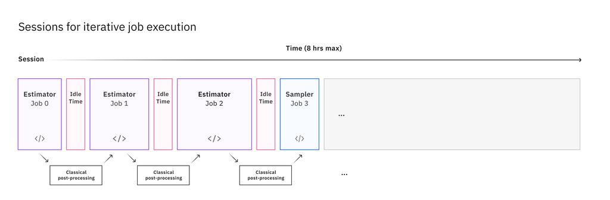
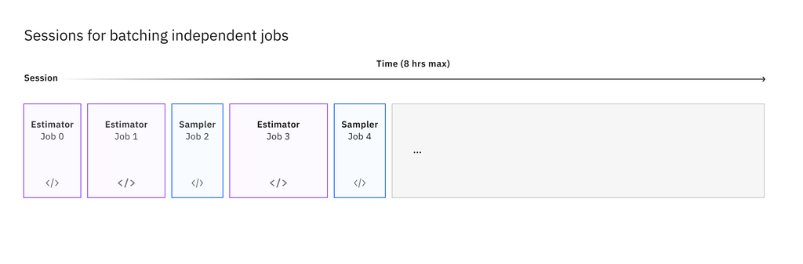
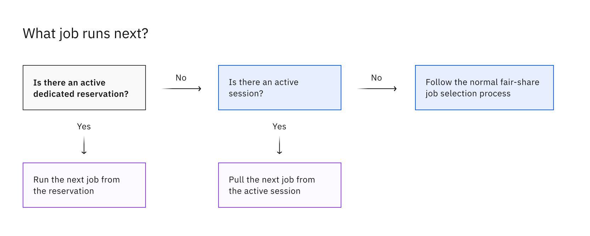

Introduction to sessions 
=============================

A session is a contract between the user and the Qiskit Runtime service that ensures that a collection of jobs can be grouped and jointly prioritized by the quantum computer’s job scheduler. This eliminates artificial delays caused by other users’ jobs running on your same quantum device during the session time.

In simple terms, once your session is active, jobs submitted within the session will not be interrupted by other users’ jobs.     

Compared with jobs that use the `fair share scheduler <https://quantum-computing.ibm.com/lab/docs/iql/manage/systems/queue>`__, sessions become particularly beneficial when running programs that require iterative calls between classical and quantum resources, where a large number of jobs are submitted sequentially. This is the case, for example, when training a variational algorithm such as VQE or QAOA, or in device characterization experiments.

Note : see details on the Faire-share scheduler - https://quantum-computing.ibm.com/lab/docs/iql/manage/systems/queue

Benefits of using sessions
---------------------------

* Jobs belonging to a single algorithm run will be run together without interruptions, increasing efficiency if your program submits multiple sequential jobs. 
   Note: the queuing time does not decrease for a single job submitted within a session.
* When using sessions, the uncertainty around queuing time is significantly reduced. This allows for a better estimation of a workload’s total runtime, and better resource management.
* In a device characterization context, being able to run experiments closely together helps prevent device drifts and provide more accurate results.
* As long as the session is active, you can submit different jobs, inspect job results and re-submit new jobs without having to open a new session every time. 
  Note:  Sessions have an interactive timeout value. If no jobs are sent within this time, the session is deactivated until a new job is sent, and the device will allow other user’s jobs to run in the meantime, see TTL section for further information.
* You maintain the flexibility to deploy your programs either remotely (cloud/on-premise) or locally (your laptop).

The mechanics of sessions (queuing)
----------------------------------------

Primitive program interfaces vary based on the type of task that you want to run on the quantum computer and the corresponding data that you want returned as a result. After identifying the appropriate primitive for your program, you can use Qiskit to prepare inputs, such as circuits, observables (for Estimator), and customizable options to optimize your job. For more information, see the appropriate topic:

If there are no jobs that are part of a session waiting to be run, the next job from the regular fair-share queue is run. QPU will process jobs one at the time. Thus, jobs that belong to a session still queue up if you already have one running, but you do not have to wait for them to complete before submitting more jobs. (Becky english magic)

Note: Systems jobs such as calibration still has priority over session jobs 

Note: When a session closes, any queued jobs remaining in that session will be put into a failed state

How are sessions working for Iterations vs Batching 
----------------------------------------------------

Iterative sessions
+++++++++++++++++++++

Any session job submitted with the 5min idle time (TTL) is processed immediately - this allows some time for variational algorithms (e.g. VQE) to perform classical post processing. 

- Device is locked to user- Maximum allowed idle time is currently 5min. 
- Post-processing could be done anywhere: personal computer, cloud service, HPC Environment 

Batch sessions
+++++++++++++++++++++

Ideal for running experiments closely together to avoid device drifts e.g. device characterzation 

- Suitable for batching many jobs together 
- Jobs that fit within max session time run back-to-back on hardware

Note: When batching, jobs are not guaranteed to run in the order they are submitted    

Important!
-----------

a. Sessions vs Reservations 

If you are an IBM Quantum Premium user you get access to both reservations and sessions on specific backends. You should plan ahead if you want to use session or reservations. 

Note : If you use a session inside a reservation and all the session jobs don’t finish during the reservation window, the pending jobs outside of the window might fail. If you are using session inside a reservation we recommend you set a realistic max_execution time 

b. Sending jobs to an expired session 

Session jobs not done when the session expires will run in fair-share mode, and they might fail if the cache jobs data is expired 

Do not close a session until all jobs complete (not just submitted)

Since data from the first session job is cached and used by subsequent jobs, if the first job is cancelled, subsequent session jobs will all fail.    

How long a session stays active
--------------------------------

The length of time a session is active is controlled by the *maximum session timeout* value and the *interactive* timeout value* (TTL). The max_time timer starts when the session becomes active.  That is, when the first job runs, not just when it is queued. TTL starts after the previous job finishes. The max_time counter does not stop if a session becomes inactive.

Maximum session timeout
++++++++++++++++++++++++++++

When a session is started, it is assigned a **maximum session timeout** value.  You can set this value by using the ``max_time`` parameter, which can be greater than the program's ``max_execution_time``. For details, see `Run a primitive in a session <how_to/run_session.html>`__.

If you do not specify a timeout value, it is set to the initial job's maximum execution time and is the smaller of these values:

   * The system limit (see `What is the maximum execution time for a Qiskit Runtime job? <faqs/max_execution_time.html>`__).
   * The ``max_execution_time`` defined by the program.

After this time limit is reached, the following occurs:
* The session is permanently closed. 
* Any queued jobs are put into an error state.
* Any jobs that are not yet queued are moved to the regular fair share queue.
* No further jobs can be submitted to the session.

Interactive timeout value
+++++++++++++++++++++++++++++

Every session has an ***interactive* timeout value** of 5 minutes, which cannot be changed. If there are no session jobs queued within the TTL window, the session is temporarily deactivated and normal job selection resumes. A deactivated session can be resumed if its maximum timeout value has not been reached. The session is resumed when a subsequent sesssion job starts. Once a session is deactivated, its next job will wait in the queue like other jobs. 

After a session is deactivated, the next job in the queue is selected to run. This newly selected job (which can belong to a different user) can run as a singleton, but it can also start a different session. In other words, a deactivated session does not block the creation of other sessions. Jobs from this new session would then take priority until it is deactivated or closed, at which point normal job selection resumes once again. 

How session jobs fit into the job queue
------------------------------------------

For each backend, the first job in the session waits its turn in the queue normally, but while the session is active, subsequent jobs within the same session take priority over any other queued jobs. If there are no jobs that are part of a session, the next job from the regular fair-share queue is run. Jobs still run one at a time. Therefore, jobs that belong to a session still queue up if you already have one running, but you do not have to wait for them to complete before submitting more jobs.

.. note::
  Do not start a session inside of a reservation. If you use a session inside a reservation and not all of the session jobs finish during the reservation window, the pending jobs outside of the window might fail.   

Next steps
------------

`Run a job in a session <how_to/run_session.html>`__